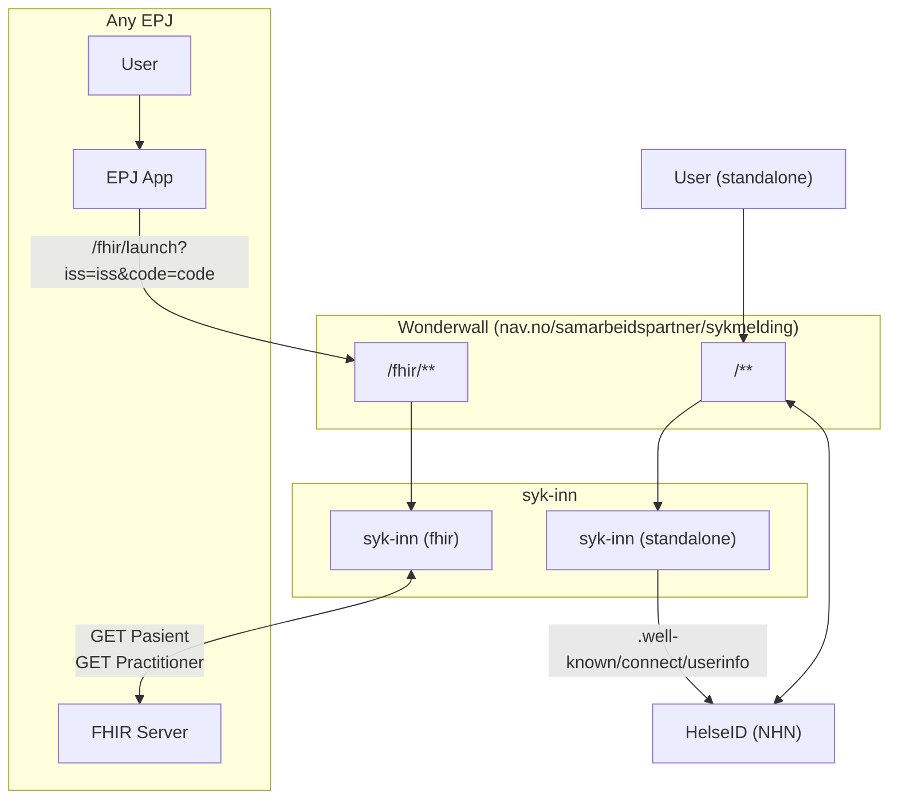

# syk-inn

## Overview

This application will be used by health care professionals to send "sykmeldinger" to NAV.

## High level decisions

- This is a monolithic application that will handle users:
    - Launching the application in a Smart on FHIR context
    - Uses the application directly using HelseID login (referered to as "standalone")
- Any asynchronous data loading or actions are using tanstack/query, and **should** have both loading **and** error state.
- Users sessions are stored in Redis, any action will validate the token using the appropriate issuer.

## High level flow

There are two apps, `syk-inn-wonderwall` is a deployed confugiration of [wonderwall](https://github.com/nais/wonderwall)
using HelseID. This acts as a reverse proxy in front of the NextJS app `syk-inn`. Wonderwall will log in any user using
HelseID on all paths except (`/fhir/**`), and add the HelseID access_token as the `Authorization` header to all
requests.



## Lingo

Code is written in English. FHIR-resources are referred to as their English names. However, sykmelding domain words
are in Norwegian. So for example, in the data layer where we integrate with FHIR, resources will be referred to as
`Patient` and `Practitioner`, but once mapped into the specific SykmeldingForm, these will be refered to as `Pasient`
and `Behandler`.

In standalone mode, there are no FHIR-resources, so the domain will be refered to in Norwegian, and code still in English.

## Points of interest in the code

### Routes (uses Next "App Dir")

- FHIR Launch route: [src/app/(fhir)/fhir/launch/page.tsx](<src/app/(fhir)/fhir/launch/page.tsx>)
- FHIR Form route: [src/app/(fhir)/fhir/page.tsx](<src/app/(fhir)/fhir/page.tsx>)
- Standalone Form route: [src/app/(standalone)/ny/page.tsx](<src/app/(standalone)/ny/page.tsx>)

### The actual form:

The form is built specifically to handle multiple "contexts" without the form having context-specific implementations. This is achieved using a variant of Dependency Injection of the possible data the form can use, using React Context.

- Root form: [src/components/ny-sykmelding-form/NySykmeldingForm.tsx](src/components/ny-sykmelding-form/NySykmeldingForm.tsx)
- The data available to the form: [src/data-fetcher/data-service.ts](src/data-fetcher/data-service.ts)
    - Form data dependency injection: [src/data-fetcher/data-provider.tsx](src/data-fetcher/data-provider.tsx)
    - See specific form implementations (form routes above) for usage of this provider

### FHIR mocking for local development (and demo application)

- FHIR server authentication mocks: [src/app/api/mocks/fhir/auth/[[...path]]/route.ts](src/app/api/mocks/fhir/auth/%5B%5B...path%5D%5D/route.ts)
- FHIR server mocks: [src/app/api/mocks/fhir/(resources)/[[...path]]/route.ts](<src/app/api/mocks/fhir/(resources)/%5B%5B...path%5D%5D/route.ts>)

## Local Development

### Prerequisites

(Use mise? `mise i` to install the required prerequisites)

- [Node.js](https://nodejs.org/en/) v22 (LTS)
- [Yarn](https://yarnpkg.com/) (`corepack enable`)
- [Docker](https://www.docker.com/)

This project relies on a Github PAT with `package:read` available as `NPM_AUTH_TOKEN`-environment variable for
authenticated access to the Github Package Registry.

### Getting Started

Install dependencies:

```bash
yarn
```

Start the development server (automatically starts redis, this is why Docker is needed):

```bash
yarn dev
```

### Running e2e tests

Headless:

```bash
yarn test:e2e
```

With interactive Playwright test runner:

```bash
yarn test:e2e --ui
```

If you are developing only e2e tests, you can run it in a special "fast mode" that uses the nextjs production server.

Pre-build the server in a special e2e mode:

```
yarn build:e2e
```

Run the playwright tests using this built server:

```bash
FAST=true yarn test:e2e --ui
```
