# syk-inn

## Overview

This application will be used by health care professionals to send "sykmeldinger" to NAV.

## High level decisions

- This is a monolithic application that will handle users:
    - Launching the application in a Smart on FHIR context
    - Uses the application directly using HelseID login (referered to as "standalone")
- Any asynchronous data loading or actions are using tanstack/query, and **should** have both loading **and** error state.
- Users sessions are stored in Valkey, any action will validate the token using the appropriate issuer.

## High level flow

There are two apps, `syk-inn-wonderwall` is a deployed confugiration of [wonderwall](https://github.com/nais/wonderwall)
using HelseID. This acts as a reverse proxy in front of the NextJS app `syk-inn`. Wonderwall will log in any user using
HelseID on all paths except (`/fhir/**`), and add the HelseID access_token as the `Authorization` header to all
requests.


## Lingo

Code is written in English. FHIR-resources are referred to as their English names. However, sykmelding domain words
are in Norwegian. So for example, in the data layer where we integrate with FHIR, resources will be referred to as
`Patient` and `Practitioner`, but once mapped into the specific SykmeldingForm, these will be refered to as `Pasient`
and `Behandler`.

In standalone mode, there are no FHIR-resources, so the domain will be refered to in Norwegian, and code still in English.

## Points of interest in the code

### Routes (uses Next "App Dir")

- FHIR Launch route: [src/app/(fhir)/fhir/(fhir-launch)/launch/page.tsx](<src/app/(fhir)/fhir/(fhir-launch)/launch/page.tsx>)
- FHIR Callback route: [src/app/(fhir)/fhir/(fhir-launch)/callback/route.ts](<src/app/(fhir)/fhir/(fhir-launch)/callback/route.ts>)
- FHIR Dashboard: [src/app/(fhir)/fhir/(fhir-launched)/page.tsx](<src/app/(fhir)/fhir/(fhir-launched)/page.tsx>)
- FHIR Sykmelding Form [src/app/(fhir)/fhir/(fhir-launched)/ny/[draftId]/page.tsx](<src/app/(fhir)/fhir/(fhir-launched)/ny/[draftId]/page.tsx>)

### The actual form:

The form is built specifically to handle multiple "contexts" without the form having context-specific implementations. This is achieved using GraphQL, where each each context the application can be "launched" in (FHIR/HelseID) will provide their own implementation of the GraphQL schema, with their corresponding auth.

- Root form: [src/components/ny-sykmelding-form/NySykmeldingForm.tsx](src/components/ny-sykmelding-form/NySykmeldingForm.tsx)
- The data available to the form: [src/data-layer/graphql/schema/root.graphqls](src/data-layer/graphql/schema/root.graphqls)

## Local Development

### Prerequisites

(Use mise? `mise i` to install the required prerequisites)

- [Node.js](https://nodejs.org/en/) (LTS)
- [Yarn](https://yarnpkg.com/) (`corepack enable`)
- [Docker](https://www.docker.com/)

This project relies on a Github PAT with `package:read` available as `NPM_AUTH_TOKEN`-environment variable for
authenticated access to the Github Package Registry.

### Getting Started

Install dependencies:

```bash
yarn
```

Start the development server (automatically starts Valkey, this is why Docker is needed):

```bash
yarn dev
```

You can run the development server with the syk-inn-api server on port 8080 by enabling the environment
variable USE_LOCAL_SYK_INN_API in .env.development.

See the README for syk-inn-api on how to run it using bootRun or IntelliJ.

## Running integration tests against local syk-inn-api

Build a local docker image for syk-inn-api and it should work out of the box.

1. cd to syk-inn-api
2. `docker build -t syk-inn-api-local .`
3. cd to syk-inn
4. `SYK_INN_API_INTEGRATION_TESTS_IMAGE=syk-inn-api-local yarn test:integration`

### Running e2e tests

Headless:

```bash
yarn e2e
```

With interactive Playwright test runner:

```bash
yarn e2e:dev
```

If you are developing only e2e tests, you can run it in a special "fast mode" that uses the nextjs production server.

Pre-build the server in a special e2e mode:

```
yarn build:e2e
```

Run the playwright tests using this built server:

```bash
FAST=true yarn e2e
```

or for interactive but with fast server:

```bash
FAST=true yarn e2e:dev
```

Note that this UI-mode, any code changes made to the application will not be reflected. But any changes to tests will automatically be reflected.

## Adding new data to the form

Follow these easy 27. steps and you'll have new data in your "Ny Sykmelding Form" in no time!

We'll use the power of TypeScript to automatically update all the mappings.

### Data flow and mappings

1. GraphQL: Update `OpprettSykmeldingInput` with a new nullable field and run `yarn gen`
    - You will now have 20-30 TSC errors in misc mapping and test files.
    - Fix these. Once you hit real application code move to the next step.
    - Update any queries/mutation that request the parent object, and add your new field to the query.
2. Draft: Update draft schema in `DraftValuesSchema` with your new value
    - Update any TS-errors, mapping _from_ draft to default form values will only be possible after step 3.
3. Form: Once you need the form value to complete the mapping, add your new types to:
    - `NySykmeldingFormState` (Redux) and `NySykmeldingFormValues` (Form)
    - Continue fixing (simple) TS-errors and update mappings
    - Update all the form mappings
        - Default values for all variants with correct precedence (see other mappings)
        - Mappings for forleng/duplicate with multiple variants (light/full/redacted)
4. API: Update the payload for the data to syk-inn-api
    - Add new value to `OpprettSykmeldingPayloadSchema` (Zod)
    - Fix 2-3 TS-errors, you should have all you need to map from GQL payload.
5. Playwright: Run all playwright tests and update any payload verifications
    - use `anything()` where applicable, or `null` for unaffected payloads.
    - Write new tests that verify your new interaction, assert that the values are provided to the API.
6. API Integration tests: Update syk-inn-api integration tests
    - Prerequisite: Actually have implemented your new value in syk-inn-api
    - Update or write new tests that verify that your payload data is received and returned correctly.

Following these simple 69 steps and resolving TypeScript-errors (pro tip: use "Project errors" in IntelliJ) you should
not be able to 'lose' any data in the mapping steps due to the strict typing. The next step is updating any visual
representation of the data.

### Visual changes

1. 🎉 Actually implement your form interactions! Have fun. 🎉
2. Update `FormValuesSummary.tsx`, used for pre-submit summary page.
3. Update `SykmeldingValues.tsx`, used for "kvittering" page and previous sykmelding page.

### High level data flow

There are a lot of stop-points in the data flow because of our strict typing, and multi-step form behaviour.

```mermaid
flowchart TD
  %% ---------- Feature-specific pipelines ----------
  subgraph NYF["Feature: Ny"]
    NY_FETCH[Start ny]
    NY_MAP[Map to defaultValues]
  end

  subgraph DRAFTF["Feature: Draft"]
    D_FETCH[Start draft]
    D_MAP[Map to defaultValues]
  end

  subgraph FORLENGF["Feature: Forleng"]
    F_FETCH[Start forleng]
    F_MAP[Map to defaultValues]
  end

  subgraph DUPLISERF["Feature: Dupliser"]
    U_FETCH[Start dupliser]
    U_MAP[Map to defaultValues]
  end

  %% ---------- Browser ----------
  subgraph BROWSER["Browser"]
    FORM[Ny sykmelding form]
    REDUX[Redux state]
    SUMMARY[Summary page]
    MAP_BACK[Map Redux -> defaultValues]
    MAP_GQL[Map Redux -> GraphQL]
  end

  %% feature -> form
  NY_FETCH --> NY_MAP --> FORM
  D_FETCH --> D_MAP --> FORM
  F_FETCH --> F_MAP --> FORM
  U_FETCH --> U_MAP --> FORM

  %% browser flow
  FORM -->|✅ Submit| REDUX --> SUMMARY
  SUMMARY -->|⬅️ Back| MAP_BACK --> FORM
  SUMMARY -->|✅ Submit| MAP_GQL

  %% ---------- Backend ----------
  MAP_GQL --> GQL[GraphQL API]
  GQL --> CONS[Consolidate]
  FHIR[FHIR] --> CONS
  CONS --> SYK[syk-inn-api]
  SYK -->|⚠️ Rule Hit ⚠️| SUMMARY
  SYK --> SUCCESS["🎉 Sykmelding created and published 🎉"]
```


