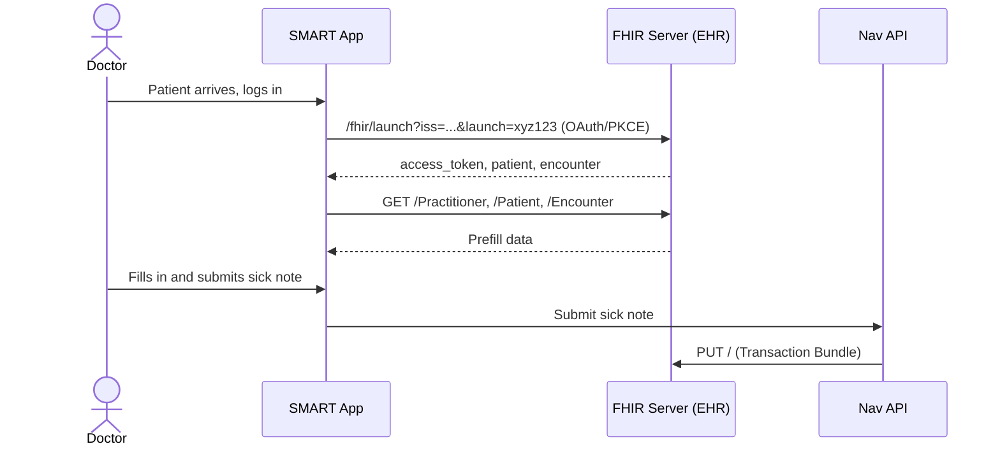
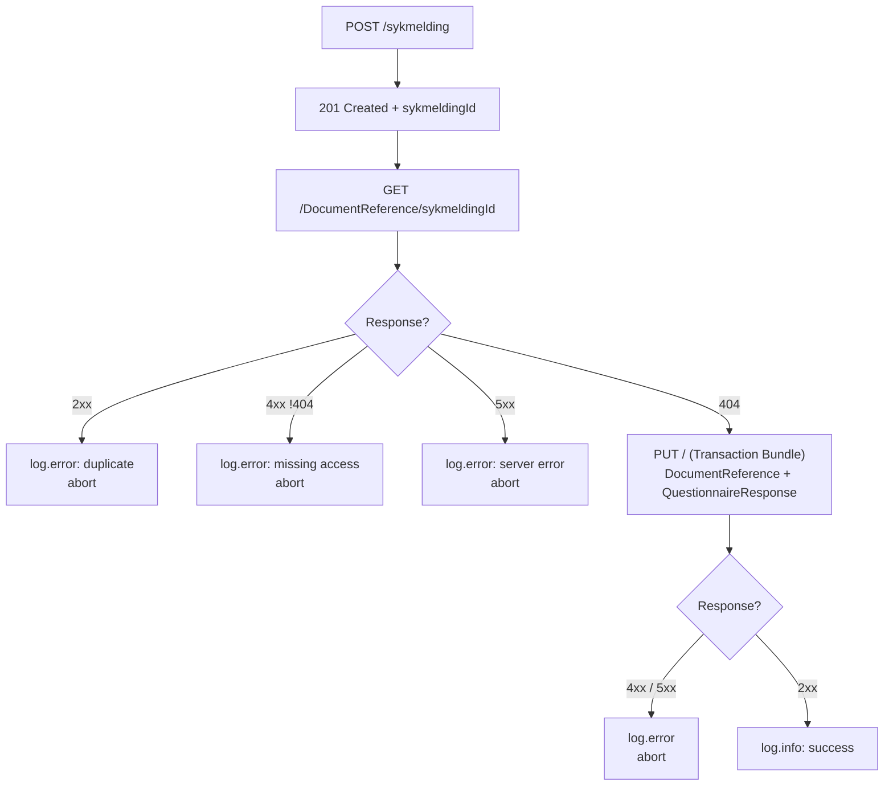

# ADR01 - FHIR Resources for writing data back to EHR

## Table of Contents

- [Context](#context)
- [Decision](#decision)
- [Consequences](#consequences)
    - [Positive](#positive)
    - [Negative](#negative)
- [Questionnaire Definition](#questionnaire-definition)
- [Implementation](#implementation)
    - [Requirements](#requirements)
    - [Access Scopes](#access-scopes)
    - [Data for Write-Back](#data-for-write-back)
    - [Flowchart (Happy Path)](#flowchart-happy-path)
    - [Step-by-Step Guide](#step-by-step-guide)
    - [Complete Example](#complete-example)
- [Alternatives](#alternatives)
    - [Still Viable Alternatives](#still-viable-alternatives)
- [Analysis: FHIR Best Practices](#analysis-fhir-best-practices)
- [Q & A](#q--a)
- [Notes](#notes)
- [References](#references)

---

## Context

Nav must be able to write structured FHIR data back to an EHR (Electronic Health Record).



## Decision

Structured upload must adhere to the following rules:

1. Structured upload is an optional benefit for those who want it.
2. Structured upload must **NOT** be burdensome for Nav or EHR vendors.
3. Nav must **NOT** use the EHR as a database for its own data.
4. Nav must **NOT** pollute FHIR resources and must use them as intended.

Based on these rules, it has been decided that the following FHIR resources and structure shall be used for structured
upload:

- **QuestionnaireResponse** – written as a standalone resource to the FHIR server, containing all structured sick note
  data as items.
- **DocumentReference** – written as a standalone resource containing the PDF and a reference to the
  QuestionnaireResponse via `context.related`.
- **Questionnaire** - defines the form schema, published publicly in the syk-inn repository.

## Consequences

### Positive

**EHR vendor**

- Standard FHIR resources - no custom extensions required
- QuestionnaireResponse is a standalone, searchable resource that can be freely indexed and utilised
- Structured data is machine-readable and easy to integrate into the EHR

**Nav**

- Respects the principle of not using the EHR as a database for Nav data
- Uses FHIR resources as intended
- Upload is optional for the EHR; Nav takes no responsibility for missing support and always provides a PDF
- Safer to retrieve and display patient history for the doctor, as data is available in the doctor's EHR system

### Negative

**EHR vendor**

- The FHIR server must support QuestionnaireResponse as a resource type
- 2 FHIR resources are used per submission
- May be perceived as Nav using the EHR as a database

**Nav**

- Requires two FHIR calls per sick note (idempotency check and transaction bundle PUT)
- Requires extended access scopes in SMART on FHIR for the sick note

## Questionnaire Definition

The Questionnaire resource that defines the form schema lives in the syk-inn repository.

**Canonical URL:**

```
https://www.nav.no/samarbeidspartner/sykmelding/fhir/R4/Questionnaire/V1
```

This is referenced by `QuestionnaireResponse.questionnaire` in all written-back sick notes.

## Implementation

The technical implementation is to create the new FHIR resource structure in syk-inn with the necessary data for
upload.

### Requirements

Requirements for architecture and data structuring.

### Access Scopes

Existing access scopes (expressed in EBNF notation) that define what Nav's SMART on FHIR solution has access to:

| #   | Access (v1)                                                         | Access (v2)                       | Grants access to                                                                 |
| --- | ------------------------------------------------------------------- | --------------------------------- | -------------------------------------------------------------------------------- |
| 1   | `openid`                                                            | `openid`                          | Request id_token containing information about the logged-in user                 |
| 2   | `profile`, `fhirUser`                                               | `profile`, `fhirUser`             | Information about the logged-in user                                             |
| 3   | `launch`                                                            | `launch`                          | Context (doctor, patient, consultation, office)                                  |
| 4   | `offline_access`                                                    | `offline_access`                  | Fetch a new access token using a refresh token even when the end user is offline |
| 5   | `patient/Patient.read`                                              | `patient/Patient.rs`              | Read access to patient information                                               |
| 6   | `patient/Encounter.read`                                            | `patient/Encounter.rs`            | Read access to consultation information                                          |
| 7   | `patient/Condition.read`                                            | `patient/Condition.rs`            | Read access to diagnosis set in the consultation                                 |
| 8   | `patient/DocumentReference.write`, `patient/DocumentReference.read` | `patient/DocumentReference.cruds` | Write, read, update, search, and delete DocumentReference linked to the patient  |

In addition to the existing scopes, Nav's SMART on FHIR solution requires the following extension to write back
structured data as a QuestionnaireResponse:

| #   | Access (v1)                                                                 | Access (v2)                           | Grants access to                                                                  |
| --- | --------------------------------------------------------------------------- | ------------------------------------- | --------------------------------------------------------------------------------- |
| 1   | `patient/QuestionnaireResponse.write`, `patient/QuestionnaireResponse.read` | `patient/QuestionnaireResponse.cruds` | Write, read, update, search, and delete QuestionnaireResponse linked to a patient |

### Data for upload

| #   | Data                                            | FHIR field                                         | JSON                                                              | Notes                                                                                                                                                                                                                                                                                           |
| --- | ----------------------------------------------- | -------------------------------------------------- | ----------------------------------------------------------------- | ----------------------------------------------------------------------------------------------------------------------------------------------------------------------------------------------------------------------------------------------------------------------------------------------- |
| 1   | `sykmeldingId`                                  | `DocumentReference.id`                             | `{ "resourceType": "DocumentReference", "id": "{sykmeldingId}" }` | Nav sets the DocumentReference resource id to the sykmelding ID for traceability. The EHR must support client-assigned resource ids (standard FHIR PUT semantics).                                                                                                                              |
| 1b  | UUID v4 (Nav-generated)                         | `QuestionnaireResponse.id`                         | `{ "resourceType": "QuestionnaireResponse", "id": "{uuid-v4}" }`  | Nav generates a UUID v4 for the QuestionnaireResponse. Both ids are set in the same transaction bundle, so the DocumentReference can reference the QR id before it is persisted.                                                                                                                |
| 2   | Questionnaire reference                         | `QuestionnaireResponse.questionnaire`              | See example below                                                 | QuestionnaireResponse is written as a standalone resource to the FHIR server. It always refers to the publicly available Questionnaire definition via canonical URL. `encounter` links the response to the active consultation. The EHR can look up the definition to understand the structure. |
| 3   | Main diagnosis                                  | `QuestionnaireResponse.item[hoofdiagnose]`         | See example below                                                 | Main diagnosis is represented as `valueCoding` with a code system (ICD-10 or ICPC-2), code, and display text. No separate Condition resource. Code systems: ICD-10: `urn:oid:2.16.578.1.12.4.1.1.7110`, ICPC-2: `urn:oid:2.16.578.1.12.4.1.1.7170`                                              |
| 4   | Secondary diagnosis(es)                         | `QuestionnaireResponse.item[bidiagnose]`           | See example below                                                 | Represented the same way as the main diagnosis. The `bidiagnose` item can be repeated for multiple secondary diagnoses.                                                                                                                                                                         |
| 5   | Period(s), activity type, and sick leave degree | `QuestionnaireResponse.item[aktivitet]`            | See example below                                                 | Activity, period, and degree are combined into a QuestionnaireResponse `.item[]` group item. Multiple periods are represented by repeating the `aktivitet` group. `aktivitet-grad` is only included for the GRADERT (graded) type.                                                              |
| 6   | Period for the entire sick note                 | `DocumentReference.context.period`                 | See example below                                                 | The period in `DocumentReference.context.period` represents the entire sick note period (earliest fom to latest tom).                                                                                                                                                                           |
| 7   | Other statutory leave reason                    | `QuestionnaireResponse.item[annen-fravarsgrunn]`   | See example below                                                 | `valueCoding` with one of the defined enum values from the Questionnaire. Omitted if there is no other leave reason.                                                                                                                                                                            |
| 8   | Pregnancy-related                               | `QuestionnaireResponse.item[svangerskapsrelatert]` | See example below                                                 | `valueBoolean` set to the same value as in the sick note.                                                                                                                                                                                                                                       |
| 9   | Occupational injury                             | `QuestionnaireResponse.item[yrkesskade]`           | See example below                                                 | Group with boolean and optional injury date. `yrkesskade-skadedato` is omitted if not relevant. TODO: Legal clarifications needed.                                                                                                                                                              |
| 10  | Employment relationship                         | `QuestionnaireResponse.item[arbeidsforhold]`       | See example below                                                 | Employment relationship is represented as a group with employer name.                                                                                                                                                                                                                           |
| 11  | Base64-encoded PDF                              | `DocumentReference.content[0].attachment`          | See example below                                                 | The EHR is legally required to document the sick note. It will therefore continue as before as a base64-encoded PDF.                                                                                                                                                                            |
| 12  | Reference to QuestionnaireResponse              | `DocumentReference.context.related`                | See example below                                                 | `DocumentReference.context.related` references the standalone QuestionnaireResponse resource. This is the standard FHIR R4 field for linking related resources to a document.                                                                                                                   |

**Questionnaire reference example:**

```json
{
    "resourceType": "QuestionnaireResponse",
    "questionnaire": "https://www.nav.no/samarbeidspartner/sykmelding/fhir/R4/Questionnaire/V1",
    "status": "completed",
    "encounter": {
        "reference": "Encounter/ehr-encounter-001"
    }
}
```

**Main diagnosis example:**

```json
{
    "linkId": "hoveddiagnose",
    "answer": [
        {
            "valueCoding": {
                "system": "urn:oid:2.16.578.1.12.4.1.1.7110",
                "code": "M54.5",
                "display": "Korsryggsmerter"
            }
        }
    ]
}
```

**Secondary diagnosis example:**

```json
{
    "linkId": "bidiagnose",
    "answer": [
        {
            "valueCoding": {
                "system": "urn:oid:2.16.578.1.12.4.1.1.7110",
                "code": "F32.0",
                "display": "Mild depressiv episode"
            }
        }
    ]
}
```

**Activity period example:**

```json
{
    "linkId": "aktivitet",
    "item": [
        {
            "linkId": "aktivitet-type",
            "answer": [
                {
                    "valueCoding": {
                        "code": "AKTIVITET_IKKE_MULIG",
                        "display": "Aktivitet ikke mulig"
                    }
                }
            ]
        },
        {
            "linkId": "aktivitet-fom",
            "answer": [
                {
                    "valueDate": "2026-02-10"
                }
            ]
        },
        {
            "linkId": "aktivitet-tom",
            "answer": [
                {
                    "valueDate": "2026-02-24"
                }
            ]
        }
    ]
}
```

**Period for entire sick note example:**

```json
{
    "resourceType": "DocumentReference",
    "context": {
        "period": {
            "start": "2026-02-10",
            "end": "2026-02-24"
        }
    }
}
```

**Other statutory leave reason example:**

```json
{
    "linkId": "annen-fravarsgrunn",
    "answer": [
        {
            "valueCoding": {
                "code": "SMITTEFARE",
                "display": "Smittefare"
            }
        }
    ]
}
```

**Pregnancy-related example:**

```json
{
    "linkId": "svangerskapsrelatert",
    "answer": [
        {
            "valueBoolean": false
        }
    ]
}
```

**Occupational injury example:**

```json
{
    "linkId": "yrkesskade",
    "item": [
        {
            "linkId": "yrkesskade-er-yrkesskade",
            "answer": [
                {
                    "valueBoolean": true
                }
            ]
        },
        {
            "linkId": "yrkesskade-skadedato",
            "answer": [
                {
                    "valueDate": "2025-06-15"
                }
            ]
        }
    ]
}
```

**Employment relationship example:**

```json
{
    "linkId": "arbeidsforhold",
    "item": [
        {
            "linkId": "arbeidsforhold-arbeidsgivernavn",
            "answer": [
                {
                    "valueString": "Arbeidsgiver AS"
                }
            ]
        }
    ]
}
```

**Base64-encoded PDF example:**

```json
{
    "resourceType": "DocumentReference",
    "content": [
        {
            "attachment": {
                "contentType": "application/pdf",
                "data": "JVBERi0xLbXBsZQ=="
            }
        }
    ]
}
```

**Reference to QuestionnaireResponse example:**

```json
{
    "resourceType": "DocumentReference",
    "context": {
        "related": [
            {
                "reference": "QuestionnaireResponse/{id}"
            }
        ]
    }
}
```

### Flowchart (Happy Path)



### Step-by-Step Guide

1. Front-end sends POST to back-end with a sick note payload.
2. Front-end receives `201 Created` with sick note ID.
3. Front-end performs `GET /DocumentReference/{sykmeldingId}` as an idempotency check:
    - `2xx` → `log.error` (duplicate, abort)
    - `!404 4xx` → `log.error` (missing access, abort)
    - `5xx` → `log.error` (server error, abort)
    - `404` → proceed
4. Front-end sends `PUT /` with a FHIR transaction bundle containing both DocumentReference (`id = sykmeldingId`) and
   QuestionnaireResponse (`id = uuid-v4`). The DocumentReference already contains `context.related` referencing the QR
   by the pre-assigned uuid-v4:
    - `4xx`/`5xx` → `log.error` (abort — transaction is atomic, neither resource is persisted)
    - `2xx` → `log.info` (success)

### Complete Example

#### Transaction Bundle (DocumentReference + QuestionnaireResponse)

```json
{
    "resourceType": "Bundle",
    "type": "transaction",
    "entry": [
        {
            "fullUrl": "QuestionnaireResponse/e3f7a92b-1d44-4c8e-b6f0-2a9d7c5e1038",
            "resource": {
                "resourceType": "QuestionnaireResponse",
                "id": "e3f7a92b-1d44-4c8e-b6f0-2a9d7c5e1038",
                "questionnaire": "https://www.nav.no/samarbeidspartner/sykmelding/fhir/R4/Questionnaire/V1",
                "status": "completed",
                "subject": {
                    "reference": "Patient/ehr-patient-001"
                },
                "encounter": {
                    "reference": "Encounter/ehr-encounter-001"
                },
                "authored": "2026-02-10T09:30:00+01:00",
                "author": {
                    "reference": "Practitioner/ehr-practitioner-001"
                },
                "item": [
                    {
                        "linkId": "hoveddiagnose",
                        "answer": [
                            {
                                "valueCoding": {
                                    "system": "urn:oid:2.16.578.1.12.4.1.1.7110",
                                    "code": "M54.5",
                                    "display": "Korsryggsmerter"
                                }
                            }
                        ]
                    },
                    {
                        "linkId": "bidiagnose",
                        "answer": [
                            {
                                "valueCoding": {
                                    "system": "urn:oid:2.16.578.1.12.4.1.1.7110",
                                    "code": "F32.0",
                                    "display": "Mild depressiv episode"
                                }
                            }
                        ]
                    },
                    {
                        "linkId": "aktivitet",
                        "item": [
                            {
                                "linkId": "aktivitet-type",
                                "answer": [
                                    {
                                        "valueCoding": {
                                            "code": "AKTIVITET_IKKE_MULIG",
                                            "display": "Aktivitet ikke mulig"
                                        }
                                    }
                                ]
                            },
                            {
                                "linkId": "aktivitet-fom",
                                "answer": [
                                    {
                                        "valueDate": "2026-02-10"
                                    }
                                ]
                            },
                            {
                                "linkId": "aktivitet-tom",
                                "answer": [
                                    {
                                        "valueDate": "2026-02-24"
                                    }
                                ]
                            }
                        ]
                    },
                    {
                        "linkId": "aktivitet",
                        "item": [
                            {
                                "linkId": "aktivitet-type",
                                "answer": [
                                    {
                                        "valueCoding": {
                                            "code": "GRADERT",
                                            "display": "Gradert"
                                        }
                                    }
                                ]
                            },
                            {
                                "linkId": "aktivitet-fom",
                                "answer": [
                                    {
                                        "valueDate": "2026-02-25"
                                    }
                                ]
                            },
                            {
                                "linkId": "aktivitet-tom",
                                "answer": [
                                    {
                                        "valueDate": "2026-03-24"
                                    }
                                ]
                            },
                            {
                                "linkId": "aktivitet-grad",
                                "answer": [
                                    {
                                        "valueInteger": 60
                                    }
                                ]
                            }
                        ]
                    },
                    {
                        "linkId": "aktivitet",
                        "item": [
                            {
                                "linkId": "aktivitet-type",
                                "answer": [
                                    {
                                        "valueCoding": {
                                            "code": "GRADERT",
                                            "display": "Gradert"
                                        }
                                    }
                                ]
                            },
                            {
                                "linkId": "aktivitet-fom",
                                "answer": [
                                    {
                                        "valueDate": "2026-03-25"
                                    }
                                ]
                            },
                            {
                                "linkId": "aktivitet-tom",
                                "answer": [
                                    {
                                        "valueDate": "2026-04-14"
                                    }
                                ]
                            },
                            {
                                "linkId": "aktivitet-grad",
                                "answer": [
                                    {
                                        "valueInteger": 20
                                    }
                                ]
                            }
                        ]
                    },
                    {
                        "linkId": "svangerskapsrelatert",
                        "answer": [
                            {
                                "valueBoolean": false
                            }
                        ]
                    },
                    {
                        "linkId": "yrkesskade",
                        "item": [
                            {
                                "linkId": "yrkesskade-er-yrkesskade",
                                "answer": [
                                    {
                                        "valueBoolean": true
                                    }
                                ]
                            },
                            {
                                "linkId": "yrkesskade-skadedato",
                                "answer": [
                                    {
                                        "valueDate": "2025-06-15"
                                    }
                                ]
                            }
                        ]
                    },
                    {
                        "linkId": "arbeidsforhold",
                        "item": [
                            {
                                "linkId": "arbeidsforhold-arbeidsgivernavn",
                                "answer": [
                                    {
                                        "valueString": "Arbeidsgiver AS"
                                    }
                                ]
                            }
                        ]
                    }
                ]
            },
            "request": {
                "method": "PUT",
                "url": "QuestionnaireResponse/e3f7a92b-1d44-4c8e-b6f0-2a9d7c5e1038"
            }
        },
        {
            "fullUrl": "DocumentReference/{sykmelding-id}",
            "resource": {
                "resourceType": "DocumentReference",
                "id": "{sykmelding-id}",
                "status": "current",
                "type": {
                    "coding": [
                        {
                            "system": "urn:oid:2.16.578.1.12.4.1.1.9602",
                            "code": "J01-2",
                            "display": "Sykmeldinger og trygdesaker"
                        }
                    ],
                    "text": "Sykmelding"
                },
                "subject": {
                    "reference": "Patient/ehr-patient-001"
                },
                "author": [
                    {
                        "reference": "Practitioner/ehr-practitioner-001"
                    }
                ],
                "content": [
                    {
                        "attachment": {
                            "contentType": "application/pdf",
                            "language": "NO-nb",
                            "title": "Sykmelding",
                            "data": "JVBERi0xLjQgZXhhbXBsZQ=="
                        }
                    }
                ],
                "context": {
                    "encounter": [
                        {
                            "reference": "Encounter/ehr-encounter-001"
                        }
                    ],
                    "period": {
                        "start": "2026-02-10",
                        "end": "2026-04-14"
                    },
                    "related": [
                        {
                            "reference": "QuestionnaireResponse/e3f7a92b-1d44-4c8e-b6f0-2a9d7c5e1038"
                        }
                    ]
                }
            },
            "request": {
                "method": "PUT",
                "url": "DocumentReference/{sykmelding-id}"
            }
        }
    ]
}
```

## Alternatives

Alternative solutions and FHIR resources that were considered and rejected:

| #   | FHIR approach                                             | Rejected because                                                                                                                                                                                                                                                                                                                                                                                         |
| --- | --------------------------------------------------------- | -------------------------------------------------------------------------------------------------------------------------------------------------------------------------------------------------------------------------------------------------------------------------------------------------------------------------------------------------------------------------------------------------------- |
| 1   | Contained QuestionnaireResponse in DocumentReference      | Unnecessarily tightly couples QR to DocumentReference. Removes the possibility of standalone identity, search, and indexing. EHR must dig inside DocumentReference to utilise structured data.                                                                                                                                                                                                           |
| 2   | Base64-encoded QuestionnaireResponse in DocumentReference | Base64-encoding a structured FHIR resource in the attachment field pollutes the intent of DocumentReference attachments. Attachments are designed for opaque binary objects (PDF, images), not for FHIR resources with their own semantics.                                                                                                                                                              |
| 3   | Bundle (document) + Composition                           | Unnecessary complexity. Bundle and Composition add an extra layer without added value when all structured data can be represented in `QuestionnaireResponse.item`. Increases the risk of overuse of contained resources and pollution of FHIR resource definitions. Nested contained resources are not allowed in FHIR anyway ([FHIR R4 Contained](https://www.hl7.org/fhir/references.html#contained)). |
| 4   | Separate Condition resources                              | Diagnoses are better represented as `valueCoding` in QuestionnaireResponse. Separate Condition resources risk polluting EHR data and violate the principle of not using the EHR as a database.                                                                                                                                                                                                           |
| 5   | Separate Organization resources                           | Employer information is better represented as simple string items in QuestionnaireResponse. Separate Organization resources are overkill for name + org number.                                                                                                                                                                                                                                          |
| 6   | Task                                                      | Requires Extension to link periods with degree. Considered for future use in workflow optimisation.                                                                                                                                                                                                                                                                                                      |
| 7   | Basic                                                     | Experimental resource requiring Extension. Suitable for prototyping, not production.                                                                                                                                                                                                                                                                                                                     |
| 8   | no-basis-Sykmelding                                       | Nav is not a healthcare organisation and should not create its own FHIR resource definitions.                                                                                                                                                                                                                                                                                                            |
| 9   | Observation                                               | Incorrect use of a resource intended for clinical observations.                                                                                                                                                                                                                                                                                                                                          |

### Still Viable Alternatives

Alternatives not currently used but kept open pending EHR feedback:

| #   | FHIR approach                                                                                                                                    | Notes                                                                                                                                                                                                                                                                                                                                                                                 |
| --- | ------------------------------------------------------------------------------------------------------------------------------------------------ | ------------------------------------------------------------------------------------------------------------------------------------------------------------------------------------------------------------------------------------------------------------------------------------------------------------------------------------------------------------------------------------- |
| 1   | `sykmeldingId` as `DocumentReference.identifier[0]` (CodeableConcept) + `QuestionnaireResponse.identifier` (CodeableConcept), two separate POSTs | Lets the EHR assign its own resource ids. Nav stores the sykmelding ID as a coded `Identifier` (with `type` CodeableConcept, `system`, and `value`) in both resources. The idempotency check becomes a search by identifier (`GET /DocumentReference?identifier=system\|value`). Useful if EHRs reject client-assigned resource ids or if transaction bundle support is inconsistent. |

## Analysis: FHIR Best Practices

### Why a Standalone QuestionnaireResponse?

The FHIR specification provides clear guidelines on when resources should be standalone vs. embedded:

1. **Contained resources** are intended for data that does not need a standalone identity and will never be referenced
   from outside ([FHIR R4 Contained](https://www.hl7.org/fhir/references.html#contained)).
2. **Base64 attachments** are intended for opaque binary objects (PDF, images), not for structured FHIR resources with
   their own semantics ([FHIR R4 DocumentReference](https://www.hl7.org/fhir/documentreference.html)).
3. **Standalone resources with references** are recommended when data has its own identity, can be looked up separately,
   and has value independent of the parent object.

QuestionnaireResponse is a fully-fledged FHIR resource with its own semantics. Embedding it (either as contained or
base64) undermines this:

- **Base64 pollutes the attachment field.** Attachments are for opaque blobs, not structured FHIR resources.
- **Contained removes the possibility of standalone search and indexing.** EHR vendors who want to utilise structured
  data must dig inside DocumentReference.

With a standalone QuestionnaireResponse:

- The EHR can index and search on QuestionnaireResponse independently of DocumentReference
- The resource is used as the FHIR specification intends
- DocumentReference remains clean – it only contains PDF and metadata, which is its purpose
- The reference via `context.related` is the FHIR R4 field designed for this linkage

### Reference Direction

FHIR best practice recommends one-way references over circular dependencies. DocumentReference is the natural "owner" of
the relationship because it is the outer document layer. FHIR search handles reverse lookups without the need for
explicit back-references.

### Perspectives

| #   | Perspective | Assessment                                                                                                                                                                           |
| --- | ----------- | ------------------------------------------------------------------------------------------------------------------------------------------------------------------------------------ |
| 1   | EHR vendor  | The FHIR server must support QuestionnaireResponse as a resource type. Most modern FHIR R4 servers do this. Standalone QR is easier to index than contained/base64.                  |
| 2   | Clinician   | Transparent to the doctor. No difference in user experience.                                                                                                                         |
| 3   | Nav         | Respects the principle of not using the EHR as a database. Data is written as standard FHIR resources, not custom extensions. Minimal burden as both resources are standard FHIR R4. |

## Q & A

| #   | Question                                                            | Answer                                                                                                                                                                                                                                                           |
| --- | ------------------------------------------------------------------- | ---------------------------------------------------------------------------------------------------------------------------------------------------------------------------------------------------------------------------------------------------------------- |
| 1   | Does the FHIR server need to understand QuestionnaireResponse?      | Yes. QuestionnaireResponse is written as a standalone resource to the FHIR server. Most modern FHIR R4 servers support this out of the box.                                                                                                                      |
| 2   | Can structured data be referenced outside DocumentReference?        | Yes. QuestionnaireResponse is a standalone resource with its own identity. It can be searched, indexed, and referenced freely by the EHR.                                                                                                                        |
| 3   | How do you find DocumentReference from a QuestionnaireResponse?     | Via FHIR search: `GET DocumentReference?related=QuestionnaireResponse/{id}`. FHIR R4 QuestionnaireResponse has no standard field for referencing back to DocumentReference.                                                                                      |
| 4   | What happens if the EHR does not support structured upload?         | DocumentReference with PDF only is sent as today. Structured data is an added benefit, not a requirement.                                                                                                                                                        |
| 5   | How does the EHR know which items are in the QuestionnaireResponse? | `QuestionnaireResponse.questionnaire` refers to the publicly published Questionnaire definition. The EHR can look up the definition to understand the structure.                                                                                                 |
| 6   | Is diagnosis always included in QuestionnaireResponse?              | Yes. The diagnosis set by the doctor in the sick note is always included as `valueCoding`, regardless of whether it has been changed from the Encounter or not. The Encounter reference in `DocumentReference.context` gives the EHR the opportunity to compare. |
| 7   | What happens if the transaction bundle fails?                       | Both resources are rolled back atomically — no orphaned resources are left on the FHIR server. Nav will log the error and surface it to the user.                                                                                                                |

## Notes

There are a few things that still need to be clarified before this ADR can be considered complete:

- Upload of medical billing codes (takster)
- Legal clarifications regarding employer data

## References

- [FHIR R4 DocumentReference](https://www.hl7.org/fhir/documentreference.html)
- [FHIR R4 QuestionnaireResponse](https://www.hl7.org/fhir/questionnaireresponse.html)
- [FHIR R4 Questionnaire](https://www.hl7.org/fhir/questionnaire.html)
