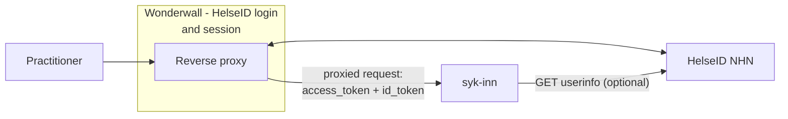
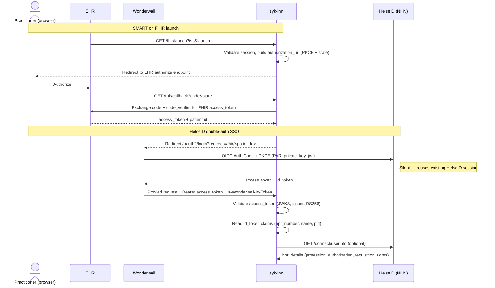

# ADR02 - HelseID

- [ADR02 - HelseID](#adr02---helseid)
  - [Context](#context)
    - [Current flow](#current-flow)
    - [Scope of this decision](#scope-of-this-decision)
  - [Decision](#decision)
  - [Consequences](#consequences)
    - [Positive](#positive)
    - [Negative](#negative)
  - [Implementation](#implementation)
    - [Prerequisites](#prerequisites)
    - [Architecture](#architecture)
    - [Access scopes](#access-scopes)
    - [Claims used](#claims-used)
    - [Step-by-step guide](#step-by-step-guide)
    - [Token validation & details](#token-validation--details)
  - [Alternatives](#alternatives)
    - [Still viable alternatives](#still-viable-alternatives)
  - [Q & A](#q--a)
  - [Notes](#notes)
  - [References](#references)

## Context

---

In order to uphold data integrity, Nav must be able to verify the identity of the practitioner
behind a sykmelding, independently of the electronic healthcare record providers (EHR 🇬🇧 / EPJ 🇳🇴).

From Nav's perspective, the information about the practitioner originates in the EHR, where it is
created, stored and maintained. Before it reaches Nav it is converted to FHIR and delivered through
the SMART on FHIR launch. Each of these steps is a point where the data can be incomplete, outdated
or incorrectly mapped, which reduces the reliability of what Nav ultimately receives. With 20+ EHR
vendors in Norway, Nav has no practical way to independently confirm that the person behind a
submitted sykmelding is who the EHR says they are.

Nav has no control over how an EHR receives, stores or provides its data. Rather than asking every
EHR to be perfect, Nav wishes to rely on official public records for the one thing that matters
most: the identity of the logged-in healthcare professional. All EHR tools used by general
practitioners already authenticate their users through HelseID (provided by Norsk Helsenett, NHN).
HelseID can therefore tell Nav, from public records such as Helsepersonellregisteret (HPR), exactly
who the logged-in healthcare professional is.

This is not a statement that EHRs cannot be trusted. It reflects a broader goal: the Norwegian
public sector should collaborate to provide EHRs, practitioners and other public services with good,
shared, authoritative data. Since HelseID is already part of every practitioner's login, Nav can
reuse it to verify identity without adding work for the EHR or the practitioner.

### Current flow

Today the Nav sykmelding SMART on FHIR app relies on the EHR's FHIR data to identify the
practitioner. This information is created, updated and deleted by the EHR, and there is no
independent source confirming that the person submitting the sykmelding is the authenticated,
HPR-registered professional they claim to be.

### Scope of this decision

This ADR concerns verifying the **identity** of the logged-in practitioner. It does **not** cover
which organisation the practitioner is acting on behalf of (for example, whether a doctor working at
_legekontor 1_, rather than _hospital 2_ or _emergency room 3_, has the correct organisation number
attached to the sykmelding). The EHR is better placed than HelseID to track where a practitioner is
currently working, and that concern is handled separately. It is out of scope for HelseID
double-auth SSO.

## Decision

---

Nav will use HelseID as a second, independent authentication step to verify the identity of the
practitioner behind a sykmelding. HelseID provides authoritative information about the logged-in
healthcare professional, taken from public records such as Helsepersonellregisteret (HPR). Combined
with OAuth 2.1 and OIDC, this gives Nav a trustworthy guarantee that the person submitting a
sykmelding is the same authenticated professional, independent of the data supplied by the EHR.

This is a silent HelseID OIDC login performed after the SMART on FHIR launch, handled by a
Wonderwall reverse proxy that reuses the HelseID session the practitioner already established when
logging in to the EHR. It requires no action from the practitioner and no development from the EHR.

HelseID does **not** establish whether a healthcare professional has the authority to write a
sykmelding — that authority is granted and managed by Nav, and is out of scope for this decision.

## Consequences

---

### Positive

**Nav**

- Authoritative practitioner identity (HPR number) from public record, independent of EHR data
- No EHR development or contract required to verify identity
- Reuses an auth mechanism every practitioner already uses — no workflow disruption

**Practitioner / EHR**

- Silent, no extra login prompt; existing workflow untouched
- No integration work for the EHR vendor

### Negative

**Nav**

- Added dependency on HelseID/NHN
- Operates and secures an additional component (Wonderwall proxy)
- Requires ongoing security monitoring

**EHR / Practitioner**

- Silent SSO breaks if the EHR uses an in-app browser without a shared HelseID session, potentially
  forcing a login prompt or blocking access

## Implementation

---

### Prerequisites

1. The EHR authenticates its users through HelseID.
2. The practitioner reaches the app in a browser that shares the EHR's HelseID session (not an
   in-app browser).
3. Nav has a registered HelseID client in HelseID selvbetjening.

### Architecture

A [Wonderwall](https://github.com/nais/wonderwall) reverse proxy in front of syk-inn handles the
HelseID login and session. The app never touches HelseID client credentials or the code exchange.

Wonderwall fronts all traffic except the SMART on FHIR launch paths. After login, every proxied
request carries the HelseID `access_token` (`Authorization` header) and `id_token`. The app
validates the access token and reads the identity claims.

### Access scopes

Scopes the HelseID client requests. They verify identity only; clinical data access is covered by
the SMART on FHIR scopes in ADR01.

| Scope                             | Grants                                       |
| --------------------------------- | -------------------------------------------- |
| `openid`                          | Request an `id_token`                        |
| `profile`                         | `name`, `given_name`, `family_name`          |
| `offline_access`                  | Refresh token for renewing the HelseID token |
| `helseid://scopes/hpr/hpr_number` | The practitioner's HPR number                |
| `helseid://scopes/identity/pid`   | Personal identifier (fødselsnummer)          |

The scope set must match what the client is provisioned for in selvbetjening.

### Claims used

| Source     | Claim                              | Use                                              |
| ---------- | ---------------------------------- | ------------------------------------------------ |
| `id_token` | `helseid://claims/hpr/hpr_number`  | HPR number (null if the user is not a behandler) |
| `id_token` | `name`                             | Display name                                     |
| `id_token` | `helseid://claims/identity/pid`    | Personal identifier (fødselsnummer)              |
| userinfo   | `helseid://claims/hpr/hpr_details` | Profession, authorization, requisition_rights    |

HPR number and identity claims come from the `id_token`. HPR details are fetched from the `userinfo`
endpoint with the access token.

### Step-by-step guide

**SMART on FHIR launch**

1. EHR launches the app: `GET /fhir/launch?iss=<EHR FHIR server>&launch=<opaque>`.
2. App validates session cookie, resolves the issuer, generates an `authorization_url` with a **PKCE
   `code_challenge`** and a `state`, then redirects the user to the EHR's authorize endpoint.
3. EHR authenticates/has the user, redirects back to `GET /fhir/callback?code=...&state=...`.
4. App exchanges `code` + stored **`code_verifier`** (PKCE) for the FHIR `access_token`; the
   authorization server returns the patient id; the app builds the destination `/fhir/<patientId>`.

**HelseID double-auth SSO**

5. App redirects to **Wonderwall**: `/oauth2/login?redirect=/fhir/<patientId>`.
6. Wonderwall runs a standard **OIDC Authorization Code + PKCE** flow against HelseID. Because the
   practitioner already has a live HelseID browser session (they logged into the EHR with HelseID),
   this completes **silently, no login prompt**.
7. Wonderwall proxies the now-authenticated request to syk-inn, adding:
   - `Authorization: Bearer <HelseID access_token>`
   - `X-Wonderwall-Id-Token: <HelseID id_token>`
8. syk-inn **validates** the access_token against HelseID JWKS from
   `.well-known/openid-configuration`, expected `issuer`, `RS256`.
9. syk-inn reads identity claims from the **id_token**: `helseid://claims/hpr/hpr_number`, `name`,
   `helseid://claims/identity/pid`.
10. Optionally calls `/connect/userinfo` with the access_token to retrieve
    `helseid://claims/hpr/hpr_details` (profession, authorization value/description,
    requisition_rights).
11. Token is short-lived; on expiry the app re-triggers the Wonderwall login to refresh.

### Token validation & details

- The `access_token` is a JWT, validated against HelseID's JWKS (`jwks_uri` from
  `.well-known/openid-configuration`), checking `issuer` and an `RS256` signature.
- Login uses Authorization Code flow with PKCE (`S256`). HelseID requires PAR, and the client
  authenticates with `private_key_jwt`.
- `id_token`s are signed with `RS256`.
- Tokens are short-lived. On expiry, Wonderwall runs a fresh login (using the `offline_access`
  refresh token) to get a new token.

## Alternatives

---

| Approach                       | Rejected because                                                                                                                                         |
| ------------------------------ | -------------------------------------------------------------------------------------------------------------------------------------------------------- |
| Trust FHIR `Practitioner` data | EHR-stored data passed through several conversion steps, with no independent proof that the submitter is the authenticated, HPR-registered professional. |
| EHR binding contract           | Nav cannot maintain identity contracts across 20+ EHR vendors. Identity should come from public record, not per-vendor agreements.                       |

### Still viable alternatives

| Approach                     | Notes                                                                                                                                                                                                                                                                                               |
| ---------------------------- | --------------------------------------------------------------------------------------------------------------------------------------------------------------------------------------------------------------------------------------------------------------------------------------------------- |
| HelseID OBO / token exchange | The EHR's HelseID client exchanges the user's token for an on-behalf-of token, giving Nav more context (e.g. the EHR client's organisation). Rejected for now: it requires EHRs to implement token exchange (heavy two-way config) and has unknown unknowns that make it fragile. May be revisited. |

## Q & A

---

| Question                                                          | Answer                                                                                                              |
| ----------------------------------------------------------------- | ------------------------------------------------------------------------------------------------------------------- |
| Does the EHR need to do any development?                          | No. The flow reuses the existing HelseID session.                                                                   |
| Does HelseID say whether the practitioner can write a sykmelding? | No. That authority is owned and managed by Nav.                                                                     |
| Does this verify the practitioner's workplace or organisation?    | No. That is out of scope and handled separately by the EHR (see Context).                                           |
| What if the EHR uses an in-app browser?                           | Silent SSO cannot reuse the HelseID session, so the practitioner may be prompted to log in or be unable to proceed. |
| What happens when the HelseID token expires?                      | Wonderwall runs a fresh login using the `offline_access` refresh token to obtain a new token.                       |

## Notes

---

Using this method to obtain information about the practitioners means that this solution must be
monitored, with focus on security. This approach MUST not get in the way of existing EHR or
practitioner workflows, meaning we must use what we have access to without the EHR needing to
intervene or the practitioner needing to do extra work.

SMART and HelseID work well for identity, authentication and authorisation, whereas FHIR works well
as structured data.

## References

---

- [Available HelseID scopes](https://utviklerportal.nhn.no/informasjonstjenester/helseid/bruksmoenstre-og-eksempelkode/bruk-av-helseid/docs/teknisk-referanse/scopes_nb_nomd)
- [HelseID token exchange](https://utviklerportal.nhn.no/informasjonstjenester/helseid/bruksmoenstre-og-eksempelkode/bruk-av-helseid/docs/teknisk-referanse/token_exchange_enmd)
