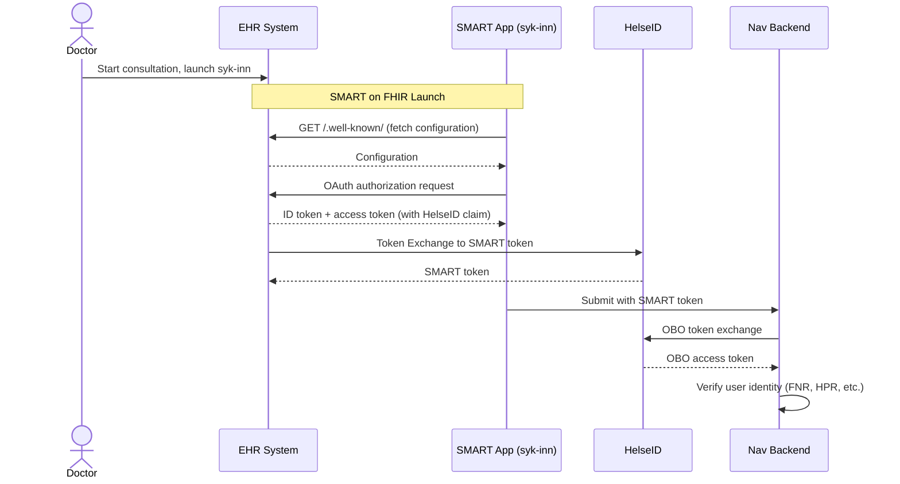

# ADR02 - SMART on FHIR secured by HelseID

## Table of Contents

- [Context](#context)
- [Decision](#decision)
- [Consequences](#consequences)
    - [Positive](#positives)
    - [Negative](#negatives)
- [Implementation](#implementation)
    - [Technical Details](#technical-details)
    - [Requirements](#requirements)
- [Alternatives](#alternatives)
    - [Alternative A: Double Authentication](#alternative-a-double-authentication)
    - [Alternative B: Zero-Trust with Token Exchange](#alternative-b-zero-trust-with-token-exchange)

---

## Context

Nav intends to verify the identity and authorization of the general practitioner who issues the sick leave certificate for the patient. To achieve this, Nav has decided to use HelseID to secure the SMART on FHIR flow with a trusted third-party. To ensure a secure authentication and authorization procedure, Nav has considered multiple options for how to achieve this in the best possible way. Out of the two best candidates we considered, the first one being double authentication by triggering a new login though single-sign-on (SSO) when the practitioner submits the sick leave certificate form. The second option is to exchange the user's HelseID access token for an access token with reduced privileges.

## Decision

The decision was made to approve the second alternative where we will exchange the user's token for a new token with reduced privileges to achieve zero-trust between the parties and to avoid having two active login sessions simultaneously. The user would log in as usual and during the SMART on FHIR launch the EHR-provider will add extra claims that will be used when authenticating and authorizing the user against HelseID. The SMART on FHIR application will be registered as a client (API-provider) in HelseID with a set of scopes to control authorization; the EHR will consume this API.

---

## Consequences

### Positives

**Practitioner**

- Seamless experience without additional login steps
- Single authentication flow throughout the user journey

**EHR vendor**

- Standardized approach that all EHR vendors can implement consistently
- Only a single authentication in the user flow
- Follows SMART on FHIR standards for adding scopes at launch (see [App Launch: Scopes and Launch Context](https://hl7.org/fhir/smart-app-launch/scopes-and-launch-context.html))

**Nav**

- Coherent authentication flow with zero-trust verification
- Identity binding between HelseID identity and EHR context is maintained
- Aligns well with existing on-behalf-of patterns used internally at Nav
- Reduced frontend complexity by avoiding multiple session management
- Clean architectural solution
- Audit logging through NHN allows verification that tokens are not misused
- Scopes and client access are limited, preventing token use beyond defined purposes

### Negatives

**EHR vendor**

- Must add HelseID claims to the SMART access token

**Nav**

- More complex token flow
- Must implement token exchange against HelseID
- Requires registration as an API in NHN's self-service portal
- EHR vendors must register the sykmelding backend API as a claim in their HelseID client

## Implementation

### Technical Details

Securing the sick leave submission with HelseID is an extension of the existing SMART on FHIR launch flow that Nav already has. The diagram below shows the current flow where Nav trusts the EHR vendor's authorization server.

In the current SMART on FHIR launch flow, we verify the user immediately after login. The flow is as follows:

1. The user has started a consultation and chooses to start the syk-inn app. This triggers the SMART on FHIR launch flow.
2. Syk-inn retrieves the `.well-known/` endpoint from the EHR's FHIR server to fetch the necessary configuration.
3. Using the fetched configuration, syk-inn makes a new request to the EHR's authorization server and logs in the user.
4. The user's authorization and authentication are verified.

With over 20 EHR vendors integrating with syk-inn, Nav benefits from a standardized approach to user verification. By leveraging HelseID as a common identity provider across the Norwegian health sector, we can offer a consistent and well-documented authentication flow that all vendors can implement uniformly. This reduces integration complexity and ensures that both Nav and EHR vendors can rely on the same trusted infrastructure for identity verification.

SMART on FHIR with HelseID will follow the same steps 1-3 as described above, but as shown in step 3.5 in the diagram, before the user is verified, syk-inn will read the HelseID claim that is attached to the access token from the EHR authorization server. This will be used to exchange for an on-behalf-of (OBO) token containing information that can be used to verify the user.

The detailed steps included in step 3.5 are:

1. In the SMART flow after user login, but before user verification, the EHR authorization server must add a HelseID claim to the SMART ID token
2. Sykmelding receives the SMART ID token with the additional HelseID claim
3. Sykmelding backend performs OBO token exchange and can use the token to verify the user and the received data (FNR, HPR, etc.) in a zero-trust environment

### Requirements

Before testing the HelseID-secured SMART on FHIR flow, the following must be completed:

1. **Sykmelding backend must be registered as an API** in NHN's self-service portal
2. **EHR must register the Sykmelding backend API** as a claim in their HelseID client

For testing in dev and production, Nav can use NHN's self-service portal to set up clients and verify that they work. Registration or changes to APIs in HelseID will also be audit-logged by NHN, which also logs events such as token exchanges.

## Alternatives

Two different alternatives were discussed for how Nav can use HelseID to verify the authentication of a logged-in practitioner submitting a sick leave certificate to Nav via the SMART on FHIR app (syk-inn). Both alternatives enable Nav to verify practitioner identity through HelseID, providing a unified authentication approach across all EHR integrations. Nav will continue to trust the EHR for correct patient and consultation context.

### Alternative A: Double Authentication

The user logs in as usual with HelseID in the EHR and writes the sick leave certificate. When the user clicks "submit", a new login with HelseID is performed. This happens via single-sign-on (SSO), and the user will experience a blank screen for a moment before being re-authenticated. This requires no further action from the user.

Technically, this means there will be two active login sessions simultaneously in the app for a user. There will thus be two logins to perform one action: submitting a sick leave certificate. This approach is modeled after the "Førerrett" application, which has handled securing SMART on FHIR with HelseID in this way.

| Pros                                                                            | Cons                                                                                                 |
| ------------------------------------------------------------------------------- | ---------------------------------------------------------------------------------------------------- |
| Clear security model where the user is explicitly authenticated when submitting | Extra step in user flow (even though it happens via SSO)                                             |
| No changes required to SMART token from EHR                                     | May cause a brief "flash" or blank screen during login                                               |
| No extra claims or scopes needed                                                | Edge case: If the user session has expired, the user may be asked to authenticate again              |
| Direct authentication against HelseID on submission                             | Must handle two authentication sessions                                                              |
| Simple security model                                                           | Must link identity from HelseID to identity from EHR context. Risk of mixing contexts for wrong user |

### Alternative B: Zero-Trust with Token Exchange

This is the **chosen alternative**.

The second alternative is a zero-trust solution with on-behalf-of token exchange, very similar to what already happens internally at Nav when applications communicate with each other. The user's HelseID token from the EHR will be exchanged for a new token from HelseID with limited access based on the scopes we define. This requires the EHR to add some extra claims when running SMART on FHIR launch at application startup; these will be used to verify the user's authorization against HelseID. Adding additional scopes at launch also follows the standard, which indicates this is acceptable (see [App Launch: Scopes and Launch Context](https://hl7.org/fhir/smart-app-launch/scopes-and-launch-context.html)).

The user logs in with HelseID as usual in the EHR, and when the user starts the syk-inn application and SMART launch is performed, extra claims are added that will be used to authenticate and authorize the user and syk-inn against HelseID. Syk-inn is registered as a client (API provider) in HelseID with a set of scopes for access control, and the EHR is a consumer of this API. As part of the SMART launch flow, after login, syk-inn will go to HelseID to exchange the access token for an access token with reduced scope containing information that can be used to verify that the user is logged in with HelseID and has the necessary permissions to use the application.

| Pros                                                                    | Cons                                             |
| ----------------------------------------------------------------------- | ------------------------------------------------ |
| Seamless experience without extra login                                 | EHR must add HelseID claim in SMART access token |
| Only one authentication in user flow                                    | More complex token flow                          |
| Can verify user via token from HelseID                                  | Must implement token exchange against HelseID    |
| Fits well with existing on-behalf-of pattern at Nav                     |                                                  |
| Less complex frontend state                                             |                                                  |
| Clean architectural solution                                            |                                                  |
| Identity binding between HelseID identity and EHR context is maintained |                                                  |

## References

- [HelseID on SMART on FHIR](../smart/helseid-on-smart-on-fhir.md)
- [SMART App Launch: Scopes and Launch Context](https://hl7.org/fhir/smart-app-launch/scopes-and-launch-context.html)
- [NHN Token Exchange Documentation](https://utviklerportal.nhn.no/informasjonstjenester/helseid/bruksmoenstre-og-eksempelkode/bruk-av-helseid/docs/teknisk-referanse/token_exchange_enmd)
