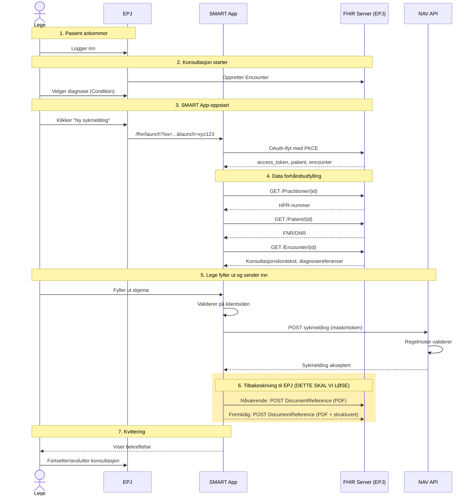
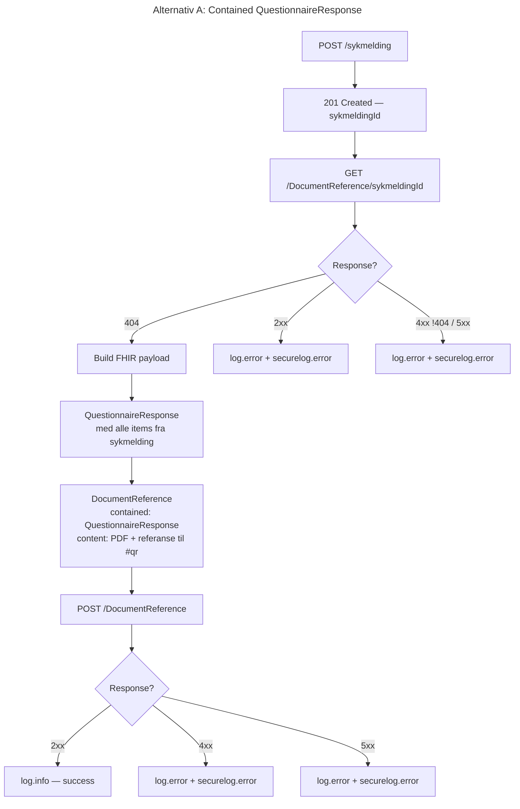
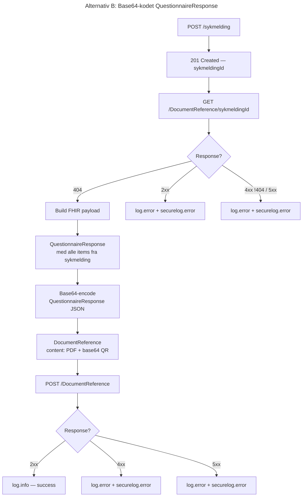

## Kontekst

Nav må kunne skrive tilbake strukturerte FHIR data til en EPJ.



## Beslutning

Strukturert tilbakeskriving må forholde seg til følgende regler:

- Strukturert tilbakeskriving er en ekstra gode for de som ønsker det.
- Strukturert tilbakeskriving skal IKKE være belastende for Nav eller EPJ.
- Nav må IKKE bruke EPJ som database for sine data.
- Nav må IKKE forurense FHIR ressurser og bruke de som de er tiltenkt.
- Strukturerte data skal representeres som svar på et definert skjema (
  Questionnaire/QuestionnaireResponse).

Basert på disse reglene er det besluttet at for strukturert tilbakeskriving skal det benyttes
følgende FHIR ressurser:

- **DocumentReference** — det ytre laget, slik det allerede er i dag for PDF
- **QuestionnaireResponse** — bærer alle strukturerte sykmeldingsdata som items
- **Questionnaire** — definerer skjemaet, publisert offentlig i dette repoet

QuestionnaireResponse refererer til en offentlig tilgjengelig
[Questionnaire-definisjon](../fhir/questionnaire.json) via `QuestionnaireResponse.questionnaire`.

Alle strukturerte data (diagnoser, perioder, booleske felt, arbeidsgiver) representeres som
`QuestionnaireResponse.item[]` med passende verdityper (`valueCoding`, `valueDate`, `valueInteger`,
`valueBoolean`, `valueString`). Det opprettes **ingen** separate FHIR-ressurser for disse dataene.

### To alternativer under utprøving

Vi tester to alternativer for hvordan QuestionnaireResponse leveres i DocumentReference. Begge
alternativene dokumenteres fullt ut i denne ADR-en. Etter testing mot EPJ vil det alternativet som
**ikke** velges fjernes.

|                        | Alternativ A: Contained                         | Alternativ B: Base64-kodet                    |
| ---------------------- | ----------------------------------------------- | --------------------------------------------- |
| **Plassering**         | `DocumentReference.contained[]`                 | `DocumentReference.content[].attachment.data` |
| **Referanse**          | `content[].attachment.url: "#sykmelding-qr"`    | Ingen referanse, data er inline               |
| **FHIR-server krav**   | Må forstå QuestionnaireResponse som ressurstype | Ingen ekstra krav (opak blob)                 |
| **Konsistent med PDF** | Nei, annen mekanisme                            | Ja, identisk mønster som PDF                  |
| **Parsebarhet**        | Direkte tilgjengelig som FHIR-ressurs           | Krever base64-dekoding først                  |

## Questionnaire-definisjon

Questionnaire-ressursen som definerer skjemaet lever i dette repoet:
[`docs/fhir/questionnaire.json`](./questionnaire.json)

Kanonisk URL: `http://nav.no/fhir/R4/Questionnaire/v1`

Denne refereres av `QuestionnaireResponse.questionnaire` i alle tilbakeskrevne sykmeldinger.

### Definerte items

| linkId                                           | Type                      | Required | Repeats | Beskrivelse                                                                |
| ------------------------------------------------ | ------------------------- | -------- | ------- | -------------------------------------------------------------------------- |
| `hoveddiagnose`                                  | open-choice (valueCoding) | Ja       | Nei     | ICD-10 / ICPC-2 kode                                                       |
| `bidiagnose`                                     | open-choice (valueCoding) | Nei      | Ja      | ICD-10 / ICPC-2 kode(r)                                                    |
| `aktivitet`                                      | group                     | Ja       | Ja      | Sykmeldingsperiode                                                         |
| `aktivitet/aktivitet-type`                       | choice (valueCoding)      | Ja       | —       | AKTIVITET_IKKE_MULIG, GRADERT, AVVENTENDE, BEHANDLINGSDAGER, REISETILSKUDD |
| `aktivitet/aktivitet-fom`                        | date                      | Ja       | —       | Fra og med dato                                                            |
| `aktivitet/aktivitet-tom`                        | date                      | Ja       | —       | Til og med dato                                                            |
| `aktivitet/aktivitet-grad`                       | integer                   | Nei      | —       | Sykmeldingsgrad (1–100), kun for GRADERT                                   |
| `svangerskapsrelatert`                           | boolean                   | Ja       | Nei     | Sykdommen er svangerskapsrelatert                                          |
| `annen-fravarsgrunn`                             | choice (valueCoding)      | Nei      | Nei     | Enum: ABORT, ARBEIDSRETTET_TILTAK, BEHANDLING_FORHINDRER_ARBEID, ...       |
| `yrkesskade`                                     | group                     | Nei      | Nei     | Yrkesskade-informasjon                                                     |
| `yrkesskade/yrkesskade-er-yrkesskade`            | boolean                   | Ja       | —       | Kan skyldes yrkesskade/yrkessykdom                                         |
| `yrkesskade/yrkesskade-skadedato`                | date                      | Nei      | —       | Skadedato                                                                  |
| `arbeidsforhold`                                 | group                     | Nei      | Nei     | Arbeidsforhold                                                             |
| `arbeidsforhold/arbeidsforhold-arbeidsgivernavn` | string                    | Ja       | —       | Navn på arbeidsgiver                                                       |

## Implementasjon

Den tekniske implementasjonen er å opprette QuestionnaireResponse med data fra den innsendte
sykmeldingen og lagre den i DocumentReference sammen med PDF.

## Krav

Krav til arkitektur og strukturering av data.

### Data for tilbakeskriving

<table>
<thead>
<tr>
<th>Data</th>
<th>FHIR felt</th>
<th>Forklaring</th>
</tr>
</thead>
<tbody>
<tr>
<td>sykmeldingId</td>
<td>

```json
{
    "resourceType": "DocumentReference",
    "id": "sykmeldingId"
}
```

</td>
<td>

`id` for DocumentReference settes til sykmelding-id for sporbarhet.

</td>
</tr>
<tr>
<td>Questionnaire-referanse</td>
<td>

```json
{
    "resourceType": "QuestionnaireResponse",
    "questionnaire": "http://nav.no/fhir/R4/Questionnaire/v1",
    "status": "completed"
}
```

</td>
<td>

QuestionnaireResponse refererer alltid til den offentlig tilgjengelige Questionnaire-definisjonen
via kanonisk URL. EPJ kan slå opp definisjonen for å forstå strukturen.

</td>
</tr>
<tr>
<td>Hoveddiagnose</td>
<td>

```json
{
    "linkId": "hoveddiagnose",
    "answer": [
        {
            "valueCoding": {
                "system": "urn:oid:2.16.578.1.12.4.1.1.7110",
                "code": "M54.5",
                "display": "Korsryggsmerter"
            }
        }
    ]
}
```

</td>
<td>

Hoveddiagnose representeres som `valueCoding` med kodesystem (ICD-10 eller ICPC-2), kode og
display-tekst. Ingen separat Condition-ressurs.

Kodesystemer:

- ICD-10: `urn:oid:2.16.578.1.12.4.1.1.7110`
- ICPC-2: `urn:oid:2.16.578.1.12.4.1.1.7170`

</td>
</tr>
<tr>
<td>Bidiagnose(r)</td>
<td>

```json
{
    "linkId": "bidiagnose",
    "answer": [
        {
            "valueCoding": {
                "system": "urn:oid:2.16.578.1.12.4.1.1.7110",
                "code": "F32.0",
                "display": "Mild depressiv episode"
            }
        }
    ]
}
```

</td>
<td>

Bidiagnoser representeres på samme måte som hoveddiagnose. `bidiagnose`-item kan repeteres for flere
bidiagnoser.

</td>
</tr>
<tr>
<td>Periode(r), aktivitetstype og sykmeldingsgrad</td>
<td>

```json
{
    "linkId": "aktivitet",
    "item": [
        {
            "linkId": "aktivitet-type",
            "answer": [
                {
                    "valueCoding": {
                        "code": "AKTIVITET_IKKE_MULIG",
                        "display": "Aktivitet ikke mulig"
                    }
                }
            ]
        },
        {
            "linkId": "aktivitet-fom",
            "answer": [
                {
                    "valueDate": "2026-02-10"
                }
            ]
        },
        {
            "linkId": "aktivitet-tom",
            "answer": [
                {
                    "valueDate": "2026-02-24"
                }
            ]
        }
    ]
}
```

</td>
<td>

Aktivitet, periode og grad slås sammen i et `QuestionnaireResponse.item[]` group-item. Flere
perioder representeres ved å repetere `aktivitet`-gruppen. `aktivitet-grad` inkluderes kun for
GRADERT-type.

</td>
</tr>
<tr>
<td>Periode for hele sykmeldingen</td>
<td>

```json
{
    "resourceType": "DocumentReference",
    "context": {
        "period": {
            "start": "2026-02-10",
            "end": "2026-02-24"
        }
    }
}
```

</td>
<td>

Perioden i `DocumentReference.context.period` representerer hele sykmeldingsperioden (tidligste fom
til seneste tom).

</td>
</tr>
<tr>
<td>Annen lovfestet fraværsgrunn</td>
<td>

```json
{
    "linkId": "annen-fravarsgrunn",
    "answer": [
        {
            "valueCoding": {
                "code": "SMITTEFARE",
                "display": "Smittefare"
            }
        }
    ]
}
```

</td>
<td>

`valueCoding` med en av de definerte enum-verdiene fra Questionnaire. Utelates dersom det ikke er
annen fraværsgrunn.

</td>
</tr>
<tr>
<td>Svangerskapsrelatert</td>
<td>

```json
{
    "linkId": "svangerskapsrelatert",
    "answer": [
        {
            "valueBoolean": false
        }
    ]
}
```

</td>
<td>

`valueBoolean` satt til samme verdi som i sykmeldingen.

</td>
</tr>
<tr>
<td>Yrkesskade</td>
<td>

```json
{
    "linkId": "yrkesskade",
    "item": [
        {
            "linkId": "yrkesskade-er-yrkesskade",
            "answer": [
                {
                    "valueBoolean": true
                }
            ]
        },
        {
            "linkId": "yrkesskade-skadedato",
            "answer": [
                {
                    "valueDate": "2025-06-15"
                }
            ]
        }
    ]
}
```

</td>
<td>

Gruppe med boolean og valgfri skadedato. `yrkesskade-skadedato` utelates dersom ikke relevant.

</td>
</tr>
<tr>
<td>Arbeidsforhold</td>
<td>

```json
{
    "linkId": "arbeidsforhold",
    "item": [
        {
            "linkId": "arbeidsforhold-arbeidsgivernavn",
            "answer": [
                {
                    "valueString": "Arbeidsgiver AS"
                }
            ]
        }
    ]
}
```

</td>
<td>

**TODO**: Juridiske avklaringer må på plass.

Arbeidsforhold representeres som en gruppe med arbeidsgivernavn.

</td>
</tr>
<tr>
<td>Base64-kodet PDF</td>
<td>

```json
{
    "resourceType": "DocumentReference",
    "content": [
        {
            "attachment": {
                "contentType": "application/pdf",
                "data": "JVBERi0xLbXBsZQ=="
            }
        }
    ]
}
```

</td>
<td>

EPJ skal kunne velge å fortsatt få base64-kodet PDF dokument. PDF forblir slik det er i dag,
uavhengig av valgt alternativ for strukturerte data.

</td>
</tr>
</tbody>
</table>

## Alternativ A: Contained QuestionnaireResponse

QuestionnaireResponse legges som contained ressurs i `DocumentReference.contained[]` og refereres
fra
`DocumentReference.content[].attachment.url` med fragment-referanse (`#sykmelding-qr`).

### Flowchart (happypath)



### Steg-for-steg

1. Front-end sender POST til back-end med sykmelding-payload
2. Front-end mottar 201 CREATED med sykmelding-id
3. Front-end utfører GET /DocumentReference/{sykmelding-id} og forventer 404 NOT FOUND
    - 2xx → log.error (duplikat)
    - !404 4xx → log.error (manglende tilgang)
    - 5xx → log.error (serverfeil)
4. Front-end oppretter QuestionnaireResponse med alle items fra sykmeldingen
5. Front-end oppretter DocumentReference med:
    - `contained[]`: QuestionnaireResponse
    - `content[0]`: PDF attachment
    - `content[1]`: attachment med `url: "#sykmelding-qr"` og `contentType: "application/fhir+json"`
6. Front-end sender POST /DocumentReference
    - 2xx → log.info (success)
    - 4xx/5xx → log.error

### Komplett eksempel

```json
{
    "resourceType": "DocumentReference",
    "id": "sykmeldingId",
    "contained": [
        {
            "resourceType": "QuestionnaireResponse",
            "id": "sykmelding-qr",
            "questionnaire": "http://nav.no/fhir/R4/Questionnaire/v1",
            "status": "completed",
            "subject": {
                "reference": "Patient/ehr-patient-001"
            },
            "authored": "2026-02-10T09:30:00+01:00",
            "author": {
                "reference": "Practitioner/ehr-practitioner-001"
            },
            "item": [
                {
                    "linkId": "hoveddiagnose",
                    "answer": [
                        {
                            "valueCoding": {
                                "system": "urn:oid:2.16.578.1.12.4.1.1.7110",
                                "code": "M54.5",
                                "display": "Korsryggsmerter"
                            }
                        }
                    ]
                },
                {
                    "linkId": "bidiagnose",
                    "answer": [
                        {
                            "valueCoding": {
                                "system": "urn:oid:2.16.578.1.12.4.1.1.7110",
                                "code": "F32.0",
                                "display": "Mild depressiv episode"
                            }
                        }
                    ]
                },
                {
                    "linkId": "aktivitet",
                    "item": [
                        {
                            "linkId": "aktivitet-type",
                            "answer": [
                                { "valueCoding": { "code": "AKTIVITET_IKKE_MULIG", "display": "Aktivitet ikke mulig" } }
                            ]
                        },
                        {
                            "linkId": "aktivitet-fom",
                            "answer": [{ "valueDate": "2026-02-10" }]
                        },
                        {
                            "linkId": "aktivitet-tom",
                            "answer": [{ "valueDate": "2026-02-24" }]
                        }
                    ]
                },
                {
                    "linkId": "aktivitet",
                    "item": [
                        {
                            "linkId": "aktivitet-type",
                            "answer": [{ "valueCoding": { "code": "GRADERT", "display": "Gradert" } }]
                        },
                        {
                            "linkId": "aktivitet-fom",
                            "answer": [{ "valueDate": "2026-02-25" }]
                        },
                        {
                            "linkId": "aktivitet-tom",
                            "answer": [{ "valueDate": "2026-03-24" }]
                        },
                        {
                            "linkId": "aktivitet-grad",
                            "answer": [{ "valueInteger": 60 }]
                        }
                    ]
                },
                {
                    "linkId": "aktivitet",
                    "item": [
                        {
                            "linkId": "aktivitet-type",
                            "answer": [{ "valueCoding": { "code": "GRADERT", "display": "Gradert" } }]
                        },
                        {
                            "linkId": "aktivitet-fom",
                            "answer": [{ "valueDate": "2026-03-25" }]
                        },
                        {
                            "linkId": "aktivitet-tom",
                            "answer": [{ "valueDate": "2026-04-14" }]
                        },
                        {
                            "linkId": "aktivitet-grad",
                            "answer": [{ "valueInteger": 20 }]
                        }
                    ]
                },
                {
                    "linkId": "svangerskapsrelatert",
                    "answer": [{ "valueBoolean": false }]
                },
                {
                    "linkId": "yrkesskade",
                    "item": [
                        {
                            "linkId": "yrkesskade-er-yrkesskade",
                            "answer": [{ "valueBoolean": true }]
                        },
                        {
                            "linkId": "yrkesskade-skadedato",
                            "answer": [{ "valueDate": "2025-06-15" }]
                        }
                    ]
                },
                {
                    "linkId": "arbeidsforhold",
                    "item": [
                        {
                            "linkId": "arbeidsforhold-arbeidsgivernavn",
                            "answer": [{ "valueString": "Arbeidsgiver AS" }]
                        }
                    ]
                }
            ]
        }
    ],
    "status": "current",
    "type": {
        "coding": [
            {
                "system": "urn:oid:2.16.578.1.12.4.1.1.9602",
                "code": "J01-2",
                "display": "Sykmeldinger og trygdesaker"
            }
        ],
        "text": "Sykmelding"
    },
    "subject": {
        "reference": "Patient/ehr-patient-001"
    },
    "author": [
        {
            "reference": "Practitioner/ehr-practitioner-001"
        }
    ],
    "content": [
        {
            "attachment": {
                "contentType": "application/pdf",
                "language": "NO-nb",
                "title": "Sykmelding",
                "data": "JVBERi0xLjQgZXhhbXBsZQ=="
            }
        },
        {
            "attachment": {
                "contentType": "application/fhir+json",
                "language": "NO-nb",
                "url": "#sykmelding-qr",
                "title": "Sykmelding strukturert (QuestionnaireResponse)"
            }
        }
    ],
    "context": {
        "encounter": [
            {
                "reference": "Encounter/ehr-encounter-001"
            }
        ],
        "period": {
            "start": "2026-02-10",
            "end": "2026-04-14"
        }
    }
}
```

## Alternativ B: Base64-kodet QuestionnaireResponse

QuestionnaireResponse serialiseres som JSON, base64-kodes, og legges i
`DocumentReference.content[].attachment.data` med `contentType: "application/fhir+json"` — identisk
med hvordan PDF lagres i dag.

### Flowchart (happypath)



### Steg-for-steg

1. Front-end sender POST til back-end med sykmelding-payload
2. Front-end mottar 201 CREATED med sykmelding-id
3. Front-end utfører GET /DocumentReference/{sykmelding-id} og forventer 404 NOT FOUND
    - 2xx → log.error (duplikat)
    - !404 4xx → log.error (manglende tilgang)
    - 5xx → log.error (serverfeil)
4. Front-end oppretter QuestionnaireResponse med alle items fra sykmeldingen
5. Front-end serialiserer QuestionnaireResponse til JSON og base64-koder den
6. Front-end oppretter DocumentReference med:
    - `content[0]`: PDF attachment (base64)
    - `content[1]`: QuestionnaireResponse attachment (base64,`contentType: "application/fhir+json"`)
7. Front-end sender POST /DocumentReference
    - 2xx → log.info (success)
    - 4xx/5xx → log.error

### Komplett eksempel

> **Merk**: `attachment.data` inneholder base64-kodet QuestionnaireResponse JSON. Verdien under er
> forkortet for lesbarhet. Det fullstendige QuestionnaireResponse-objektet som kodes er vist separat
> etter DocumentReference-eksempelet.

```json
{
    "resourceType": "DocumentReference",
    "id": "sykmeldingId",
    "status": "current",
    "type": {
        "coding": [
            {
                "system": "urn:oid:2.16.578.1.12.4.1.1.9602",
                "code": "J01-2",
                "display": "Sykmeldinger og trygdesaker"
            }
        ],
        "text": "Sykmelding"
    },
    "subject": {
        "reference": "Patient/ehr-patient-001"
    },
    "author": [
        {
            "reference": "Practitioner/ehr-practitioner-001"
        }
    ],
    "content": [
        {
            "attachment": {
                "contentType": "application/pdf",
                "language": "NO-nb",
                "title": "Sykmelding",
                "data": "JVBERi0xLjQgZXhhbXBsZQ=="
            }
        },
        {
            "attachment": {
                "contentType": "application/fhir+json",
                "language": "NO-nb",
                "title": "Sykmelding strukturert (QuestionnaireResponse)",
                "data": "eyJyZXNvdXJjZVR5cGUiOiJRdWVzdGlvbm5haXJlUmVzcG9uc2UiLC..."
            }
        }
    ],
    "context": {
        "encounter": [
            {
                "reference": "Encounter/ehr-encounter-001"
            }
        ],
        "period": {
            "start": "2026-02-10",
            "end": "2026-04-14"
        }
    }
}
```

**QuestionnaireResponse-objektet som base64-kodes:**

```json
{
    "resourceType": "QuestionnaireResponse",
    "id": "sykmelding-qr",
    "questionnaire": "http://nav.no/fhir/R4/Questionnaire/v1",
    "status": "completed",
    "subject": {
        "reference": "Patient/ehr-patient-001"
    },
    "authored": "2026-02-10T09:30:00+01:00",
    "author": {
        "reference": "Practitioner/ehr-practitioner-001"
    },
    "item": [
        {
            "linkId": "hoveddiagnose",
            "answer": [
                {
                    "valueCoding": {
                        "system": "urn:oid:2.16.578.1.12.4.1.1.7110",
                        "code": "M54.5",
                        "display": "Korsryggsmerter"
                    }
                }
            ]
        },
        {
            "linkId": "bidiagnose",
            "answer": [
                {
                    "valueCoding": {
                        "system": "urn:oid:2.16.578.1.12.4.1.1.7110",
                        "code": "F32.0",
                        "display": "Mild depressiv episode"
                    }
                }
            ]
        },
        {
            "linkId": "aktivitet",
            "item": [
                {
                    "linkId": "aktivitet-type",
                    "answer": [{ "valueCoding": { "code": "AKTIVITET_IKKE_MULIG", "display": "Aktivitet ikke mulig" } }]
                },
                {
                    "linkId": "aktivitet-fom",
                    "answer": [{ "valueDate": "2026-02-10" }]
                },
                {
                    "linkId": "aktivitet-tom",
                    "answer": [{ "valueDate": "2026-02-24" }]
                }
            ]
        },
        {
            "linkId": "aktivitet",
            "item": [
                {
                    "linkId": "aktivitet-type",
                    "answer": [{ "valueCoding": { "code": "GRADERT", "display": "Gradert" } }]
                },
                {
                    "linkId": "aktivitet-fom",
                    "answer": [{ "valueDate": "2026-02-25" }]
                },
                {
                    "linkId": "aktivitet-tom",
                    "answer": [{ "valueDate": "2026-03-24" }]
                },
                {
                    "linkId": "aktivitet-grad",
                    "answer": [{ "valueInteger": 60 }]
                }
            ]
        },
        {
            "linkId": "aktivitet",
            "item": [
                {
                    "linkId": "aktivitet-type",
                    "answer": [{ "valueCoding": { "code": "GRADERT", "display": "Gradert" } }]
                },
                {
                    "linkId": "aktivitet-fom",
                    "answer": [{ "valueDate": "2026-03-25" }]
                },
                {
                    "linkId": "aktivitet-tom",
                    "answer": [{ "valueDate": "2026-04-14" }]
                },
                {
                    "linkId": "aktivitet-grad",
                    "answer": [{ "valueInteger": 20 }]
                }
            ]
        },
        {
            "linkId": "svangerskapsrelatert",
            "answer": [{ "valueBoolean": false }]
        },
        {
            "linkId": "yrkesskade",
            "item": [
                {
                    "linkId": "yrkesskade-er-yrkesskade",
                    "answer": [{ "valueBoolean": true }]
                },
                {
                    "linkId": "yrkesskade-skadedato",
                    "answer": [{ "valueDate": "2025-06-15" }]
                }
            ]
        },
        {
            "linkId": "arbeidsforhold",
            "item": [
                {
                    "linkId": "arbeidsforhold-arbeidsgivernavn",
                    "answer": [{ "valueString": "Arbeidsgiver AS" }]
                }
            ]
        }
    ]
}
```

## Analyse: FHIR best practices fra ulike perspektiver

### EPJ-leverandør (eier FHIR-serveren, mottar data)

|                      | Alternativ A: Contained                                                                                                     | Alternativ B: Base64                                                          |
| -------------------- | --------------------------------------------------------------------------------------------------------------------------- | ----------------------------------------------------------------------------- |
| **FHIR-server krav** | Serveren må kunne parse `contained` med ressurstype QuestionnaireResponse. Noen servere kan avvise ukjente contained-typer. | Ingen ekstra krav — opak blob behandles identisk med PDF.                     |
| **Kompatibilitet**   | Moderat. Avhenger av FHIR-serverens implementasjon av contained resources.                                                  | Høy. Alle servere som støtter DocumentReference med base64 PDF støtter dette. |
| **Datautnyttelse**   | EPJ kan traversere contained-ressursen direkte uten ekstra dekoding.                                                        | EPJ må base64-dekode og deretter parse JSON for å utnytte dataene.            |
| **Risiko**           | POST kan feile dersom FHIR-serveren ikke aksepterer QuestionnaireResponse som contained.                                    | Ingen ekstra risiko utover dagens PDF-flyt.                                   |

### Behandler (lege som skriver sykmelding)

Begge alternativene er transparente for legen. Ingen forskjell i brukeropplevelse.

### Offentlig myndighet (Nav — ansvar for data, ikke EPJ-eier)

|                                  | Alternativ A: Contained                                                                                                                                 | Alternativ B: Base64                                                                   |
| -------------------------------- | ------------------------------------------------------------------------------------------------------------------------------------------------------- | -------------------------------------------------------------------------------------- |
| **"Ikke bruk EPJ som database"** | Contained-ressurser er scoped til foreldreobjektet og kan ikke refereres eksternt. Likevel kan det _oppfattes_ som at vi lagrer strukturert data i EPJ. | Data er fullstendig opak for FHIR-serveren — identisk med PDF. Klart innenfor regelen. |
| **Belastning for EPJ**           | Noe mer — FHIR-server må validere contained-struktur.                                                                                                   | Minimal — ingen forskjell fra dagens PDF-flyt.                                         |
| **Fremtidig utvidbarhet**        | Lett å legge til nye items i QR uten å endre DocumentReference-strukturen.                                                                              | Identisk — QR-strukturen er uavhengig av transportmekanismen.                          |

### Oppsummering best practices

FHIR-spesifikasjonen anbefaler:

1. **Contained resources** for data som er tett koblet til foreldreobjektet og ikke trenger
   selvstendig identitet eller referanser
   utenfra ([FHIR R4 Contained](https://hl7.org/fhir/R4/references.html#contained)).
2. **Base64 attachment** for dokumenter og data som skal behandles som opake
   binærobjekter ([FHIR R4 DocumentReference](https://hl7.org/fhir/R4/documentreference.html)).

I vårt tilfelle:

- QuestionnaireResponse trenger **ikke** selvstendig identitet i EPJ
- QuestionnaireResponse skal **ikke** refereres av andre ressurser i EPJ
- Vi vil **ikke** at EPJ skal indeksere eller behandle dataene som førsteklasses FHIR-ressurser
- Vi vil at strukturerte data skal være en **ekstra gode** med minimal belastning

Basert på dette heller FHIR best practices mot **Alternativ B (base64)**, fordi:

- Det er konsistent med PDF-mønsteret som allerede fungerer
- Det eliminerer risikoen for at FHIR-serveren avviser payloaden
- Det respekterer prinsippet om at Nav ikke skal bruke EPJ som database
- EPJ som _ønsker_ å utnytte strukturerte data kan enkelt base64-dekode og parse

Alternativ A er ikke feil — contained er designet nettopp for dette formålet — men det introduserer
en unødvendig avhengighet av EPJ FHIR-serverens kapabiliteter. Endelig valg avhenger av
testresultater
fra EPJ-piloter.

## Forkastede alternativer

Følgende ble vurdert i tidligere iterasjoner av denne ADR-en og er forkastet:

| FHIR-tilnærming                     | Forkastet fordi                                                                                                                                                                                                                                                 |
| ----------------------------------- | --------------------------------------------------------------------------------------------------------------------------------------------------------------------------------------------------------------------------------------------------------------- |
| **Bundle (document) + Composition** | Unødvendig kompleksitet. Bundle og Composition tilfører et ekstra lag uten merverdi når alle strukturerte data kan representeres i QuestionnaireResponse.item. Øker risikoen for overforbruk av contained resources og forurensing av FHIR-ressursdefinisjoner. |
| **Separate Condition-ressurser**    | Diagnoser representeres bedre som `valueCoding` i QuestionnaireResponse. Separate Condition-ressurser risikerer å forurense EPJ-data og bryter med prinsippet om å ikke bruke EPJ som database.                                                                 |
| **Separate Organization-ressurser** | Arbeidsgiverinfo representeres bedre som enkle string-items i QuestionnaireResponse. Separate Organization-ressurser er overkill for navn + orgnummer.                                                                                                          |
| **Task**                            | Krever Extension for å koble perioder med grad. Vurderes for fremtidig bruk i arbeidsflyt-optimalisering.                                                                                                                                                       |
| **Basic**                           | Eksperimentell ressurs som krever Extension. Egnet for prototyping, ikke produksjon.                                                                                                                                                                            |
| **no-basis-Sykmelding**             | Nav er ikke en helsevirksomhet og bør ikke opprette egne FHIR-ressursdefinisjoner.                                                                                                                                                                              |
| **Observation**                     | Feil bruk av en ressurs ment for kliniske observasjoner.                                                                                                                                                                                                        |

## Q & A

| Q                                                                            | A                                                                                                                                                                                                                             |
| ---------------------------------------------------------------------------- | ----------------------------------------------------------------------------------------------------------------------------------------------------------------------------------------------------------------------------- |
| Må FHIR-serveren forstå QuestionnaireResponse for å lagre DocumentReference? | **Alt A (contained):** Ja, serveren må kunne parse contained QuestionnaireResponse. **Alt B (base64):** Nei, serveren behandler det som en opak blob — identisk med PDF.                                                      |
| Kan strukturerte data refereres utenfor DocumentReference?                   | Nei. I Alt A er contained-ressurser kun gyldig innenfor foreldreobjektet. I Alt B er dataene en base64-blob uten FHIR-identitet.                                                                                              |
| Hva skjer om EPJ ikke støtter strukturert tilbakeskriving?                   | DocumentReference med kun PDF sendes som i dag. Strukturerte data er en ekstra gode, ikke et krav.                                                                                                                            |
| Hvordan vet EPJ hvilke items som finnes i QuestionnaireResponse?             | `QuestionnaireResponse.questionnaire` refererer til den offentlig publiserte Questionnaire-definisjonen. EPJ kan slå opp definisjonen for å forstå strukturen.                                                                |
| Inkluderes diagnose alltid i QuestionnaireResponse?                          | Ja. Diagnosen satt av lege i sykmeldingen inkluderes alltid som `valueCoding`, uavhengig av om den er endret fra Encounter eller ikke. Encounter-referansen i `DocumentReference.context` gir EPJ mulighet til å sammenligne. |

## Referanser

- [FHIR R4 DocumentReference](https://hl7.org/fhir/R4/documentreference.html)
- [FHIR R4 QuestionnaireResponse](https://hl7.org/fhir/R4/questionnaireresponse.html)
- [FHIR R4 Questionnaire](https://hl7.org/fhir/R4/questionnaire.html)
- [FHIR R4 Contained Resources](https://hl7.org/fhir/R4/references.html#contained)
- [Contained Resources in FHIR — Outburn (guide)](https://outburn.health/contained-resources/)
- [Questionnaire-definisjon for syk-inn](./questionnaire.json)

## Notater

Det er noen få ting som fortsatt må avklares:

- Tilbakeskriving av takster (TODO)
- Juridiske avklaringer ang. arbeidsgiver (TODO)
- Endelig valg mellom Alternativ A og B basert på EPJ-testing
- Bør `DocumentReference.content` ha PDF og strukturerte data som separate attachments?

ADR-en tar IKKE høyde for oppdatering av statuser. Det antas at `DocumentReference.status` brukes
for å reflektere sykmeldingsforløpet, men dette utredes i en separat ADR.
