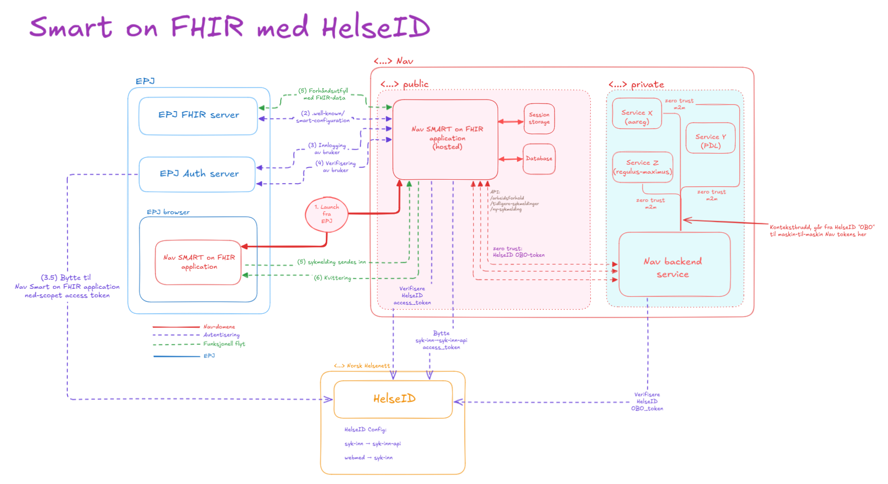

# HelseID on SMART on FHIR

> [!WARNING]
> This is a partially complete draft

## Introduction

This document defines the concept of having a SMART on FHIR launched application that is backed by a HelseID token (
on-behalf-of).

Everything defined here is purely additions to the normal launch sequence, as defined [here](./smart-launch.md).

### Simplified flow diagram



## Requirements

The actors in this flow are:

- EHR system (with FHIR server and authorization server)
- SMART on FHIR application
- HelseID authorization server

The SMART on FHIR application must be registered as a API client in HelseID, as well as having granted access to the EHR
system. This is a two-way configuration, requiring the EHR system to also grant access to the SMART on FHIR application.

## The flow

The main concept is that during a normal SoF-launch, the application will request an extra scope.

For example:

```
openid profile launch fhirUser offline_access patient/Patient.read https://helseid.nhn.no
```

The last scope here - `https://helseid.nhn.no` - this is the scope that will grant us access to a HelseID
on-behalf-of-token.

The launch flow will proceed as normal, but during the token exchange the authorisation server of the EHR system
will perform token exchange to HelseID, exchanging the users EHR (HelseID) access token for a short-lived on-behalf-of
token
specifically for the SMART on FHIR application.

The resulting OBO-token will be included as an extra claim in the users ID-token, the normal token exchange will
look like this:

```json
{
    "id_token": "<FHIR ID token>",
    "access_token": "<FHIR access token>",
    "token_type": "Bearer",
    "expires_in": 3600,
    "scope": "<SoF Scopes>",
    "patient": "317d1bb5-a3dc-4569-8440-93771f75b6c2",
    "encounter": "bbd4a2f7-3d42-41da-bf05-30d21cd2c12e"
}
```

Where the ID-token deserialized will look like this:

```json
{
    "profile": "Practitioner/4f82641e-bec4-4f2d-874c-159e20f0c7c4",
    "fhirUser": "Practitioner/4f82641e-bec4-4f2d-874c-159e20f0c7c4",
    "https://helseid.nhn.no": {
        "access_token": "<HelseID OBO token>",
        "token_type": "Bearer",
        "issuer": "https://helseid-sts.nhn.no",
        "expires_in": 300,
        "scope": "<HelseID OBO token scopes>"
    }
}
```

> [!NOTE]
> The names of the scope and claims are not final, and may be subject to change.

With this token response and ID-token, the SMART on FHIR application can verify the `access_token` with the FHIR auth
server as normal, but it can also verify the `['https://helseid.nhn.no'].access_token` (within the ID-token) with
HelseID. It can also use this token to exchange for further tokens in HelseID for additional downstream applications, if
needed.

This HelseID token is short-lived, and because it is exchanged by the EHR system, when the SMART on FHIR application
sees that the token is expired, it must request a normal token refresh from the EHR system, so that the EHR system
can perform the token exchange again and provide the SMART on FHIR application with a fresh HelseID OBO token.
