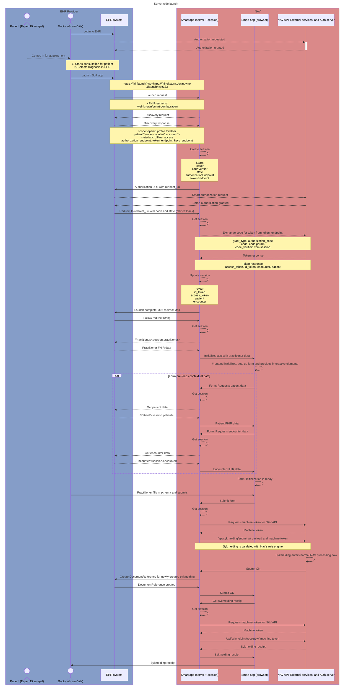

# Secure implementation of SMART on FHIR launch

## Introduction

The smarthealthit client library [fhirclient](https://docs.smarthealthit.org/client-js/) provides an implementation for
launching a SMART on FHIR app. While it does provide some mechanisms for server-to-server communication, it's launch
implementation is only client-side, and stores ID-token and access tokens in the browser's local storage.

For this reason, we have implemented a server-side launch mechanism that is compliant with the SMART on FHIR
specification, and stores the metadata and tokens in the server's key-value store.

## Sequence of server side launch (detailed)

